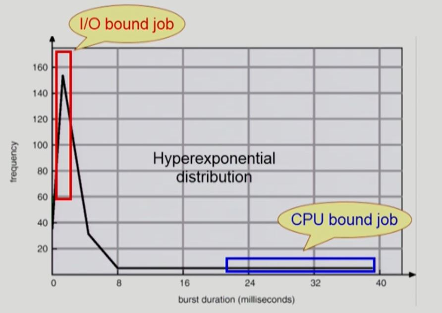
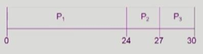
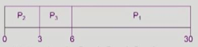
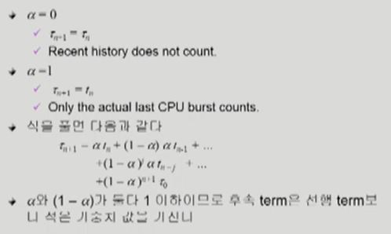
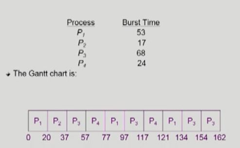
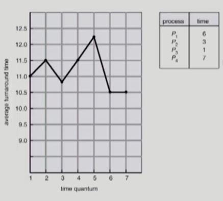
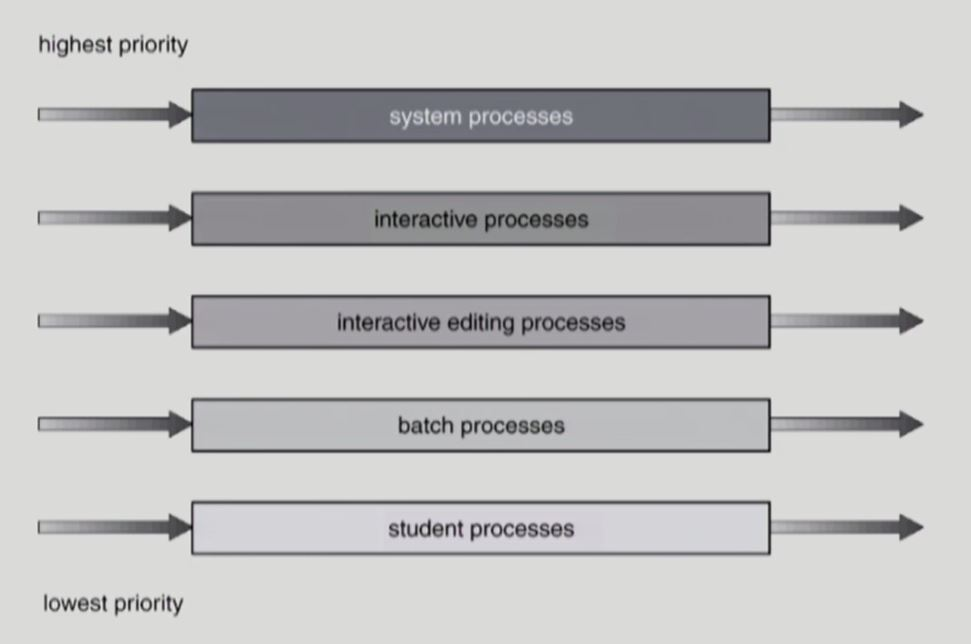
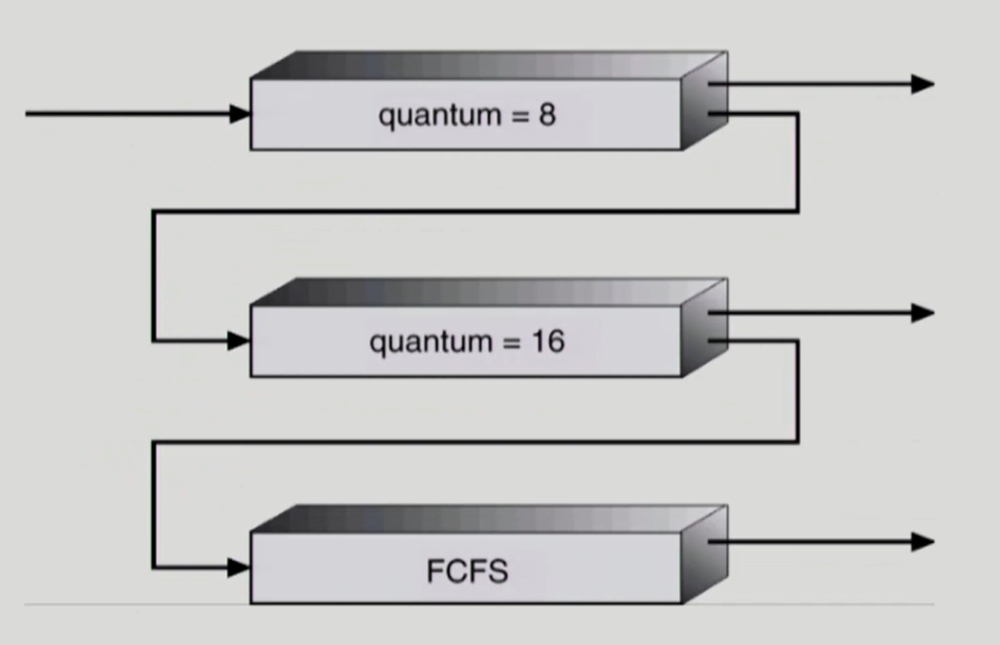

# Chapter 5. CPU Scheduling

### CPU and I/O Bursts in Program Execution

- 프로그램이 실행되면 어떤 프로그램이든 간에 아래의 path를 진행함

... load store / add store / read from file (CPU burst (Running) 

=> wait for I/O (I/O burst) 

=> store increment / index / read from file (CPU burst) 

=> wait for I/O (I/O burst) ... 

- 프로그램은 CPU burst(CPU를 연속적으로 쓰는 시간)와 I/O burst의 연속이지만 프로그램의 종류에 따라서 빈도나 길이가 달라짐

### CPU-burst Time의 분포

- 여러 종류의 job (=process)이 섞여 있기 때문에 CPU 스케줄링이 필요하다 (- I/O bound job 때문)
  - Interactive job에게 적절한 response 제공 요망
  - CPU와 I/O 장치 등 시스템 자원을 골고루 효율적으로 사용
  - 공평한 것보다 효율적 매커니즘이 중요. intractive job에게 너무 오랜 시간을 기다리게 하면 안됨.
  - 누구에게 우선적, 언제 뺏을 것인가 등이 중요한 이슈

- CPU burst가 짧은 경우가 빈번하고 긴 경우도 간혹 나타남

### 프로세스의 특성 분류

- 프로세스는 그 특성에 따라 다음 두 가지로 나눔
  - I/O-bound process
    - CPU를 잡고 계산하는 시간보다 I/O에 많은 시간이 필요한 job
    - (many short CPU bursts)
  - CPU-bound process
    - 계산 위주의 job
    - (few very long CPU bursts.)

### CPU Scheduler & Dispatcher

- CPU Scheduler

  - Ready 상태의 프로세스 중에서 이번에 CPU를 줄 프로세스를 고른다
  - 운영체제 안에서 CPU 스케줄링을 하는 커널 코드

- Dispatcher

  - CPU의 제어권을 CPU scheduler에 의해 선택된 프로세스에게 넘긴다
  - 이 과정을 context switch(문맥 교환)라고 한다

- CPU 스케줄링이 필요한 경우는 프로세스에게 다음과 같은 상태 변화가 있는 경우이다

  1. Running -> Blocked (예: I/O 요청하는 시스템 콜) : CPU가 어떤 프로세스를 잡고 있다가 오래 걸리는 작업을 하러 간 경우, 자진해서 CPU를 내어 놓아서 다른 프로세스에게 CPU가 넘어감
  2. Running -> Ready (예: 할당시간말료로 timer interrupt) : CPU를 강제로 빼앗아서 원래 있던 애를 줄서게 하고 다른 프로세스에게 CPU를 넘겨줌
  3. Blocked -> Ready (예: I/O 완료후 인터럽트) : 오래걸리는 작업이 끝나면 CPU를 얻을 수 있는 권한을 줌. 바로 CPU를 주지는 않고 Ready 상태로 보내는 것. 하지만 곧바로 넘겨야되는 경우도 있음. 
  4. Terminate : 프로세스가 종료되어서 다른 프로세스에게 넘겨야하는 경우

  - 비선점형 : 1, 4에서의 스케줄링은 nonpreemptive (=강제로 빼앗지 않고 자진 반납)
  - 선점형 : All othef scheduling is preemptive (=강제로 빼앗음)

### Scheduling Criteria

> Performance Index (= Perfomance Measure, 성능 척도)

- CPU utilization (이용률)
  - keep the CPU as busy as possible (CPU 바쁘게 일을 시켜라)
- Throughout (처리량) - 프로세스 입장에서의 CPU 성능 척도
  - \# of processes that complete their execution per time unit
- Turnaround time (소요시간, 반환시간) - 프로세스 입장에서의 CPU 성능 척도
  - amount of time to execute a particular process (CPU를 쓰러 들어와서 다 쓰고 I/O로 나갈 때까지의 걸린 시간)
- Waiting time (대기 시간) - 프로세스 입장에서의 CPU 성능 척도
  - amount of time a process has been waiting in the ready queue (ready queue에서 기다린 시간-선점형 스케줄링의 경우, CPU를 얻었다가 뺏겨서 다시 줄 서서 기다릴 수 있음. 이를 모두 합친 시간)
- Response time (응답 시간)
  - amount of time it takes from when a request was submitted until the first response is produced, not output (for time-sharing environment) (ready queue에 들어와서 처음으로 CPU를 얻기까지 걸린 시간-처음으로 얻을 때까지 기다린 시간)

### FCFS (Fisrt-Come First-Served) - 비선점형 스케줄링

- Example: 

  - Process P1 P2 P3
  - Busrt Time 24 3 3

- 프로세스의 도착 순서 P1, P2, P3

  스케줄 순서를 Gantt Chart로 나타내면 다음과 같다

  

- Waiting time for P1 = 0; P2 = 24; P3 = 27
- Average waiting time : (0+24+27)/3 = 17
- 그렇게 좋은 스케줄링 방법이 아님
  - 똑같이 0초에 도착했을 때, CPU 사용시간이 긴 프로세스가 먼저 도착하면 오래 기다려야 함.

- 프로세스의 도착 순서가 다음과 같다고 할 때,

  P2, P3, P1

  - The Gantt chart for the schedule is:

    

  - wating time for P1 = 6; P2 = 0; P3 = 3

  - Average waiting time: (66+0+3)/3 = 3

  - Much better than previous case.

  - **Convoy effect**: short process behind long process 큐에서 오래 기다리는 현상을 의미

### SJF(Shortest-Job-First)

- 각 프로세스의 다음번 CPU burst time을 가지고 스케줄링에 활용

- CPU burst time이 가장 짧은 프로세스를 제일 먼저 스케줄
- Two schemes:
  - Nonpreemptive
    - 일단 CPU를 잡으면 이번 CPU burst가 완료될 때까지 CPU를 선점(preemption) 당하지 않음
  - Preemptive
    - 현재 수행중인 프로세스의 남은 burst time보다 더 짧은 CPU burst time을 가지는 새로운 프로세스가 도착하면 CPU를 빼앗김
    - 이 방법을 Shortest-Remaining-Time-Fisrt(SRTF) 이라고도 부른다
- SJF is optimal
  - 주어진 프로세스들에 대해 minimum average waiting time을 보장 - preemptive 버전

### Example of Non-Preemptive SJF

- SJF (non-preemptive)

  .JPG)

- Average waiting time = (0+6+3+7)/4=4

### Example of Preemptive SJF

- SJF (preemptive)

  - 더 짧은 시간이 도착하면 빼앗길 수 있음

  .JPG)

- Average waiting time = (9+1+0+2)/4=3 (optimal(minimum))

- Non-preemptive 버전보다 웨이팅 시간이 짧음

### Priority Scheduling

- A priority number (integer) is associated with each process

- highest priority를 가진 프로세스에게 CPU 할당

  (smallest integer = highest priority). (작은 숫자가 우선순위가 높음)

  - Preemptive
  - nonpreemptive

- SJF는 일종의 priority scheduling이다

  priority = predicted next CPU burst time

- Problem

  - Starvation(기아 현상) : low priority processes may never execute.

    우선순위가 낮은 프로세스가 지나치게 오래 기다려서 영원히 CPU를 얻지 못할 수도 있다는 문제점이 있음

- Solution

  - Aging(노화) : as time progresses increase the priority of the process.

    오래 기다리면 우선순위를 조금씩 높여주자는 의미

### 다음 CPU Busrt Time의 예측

- 다음번 CPU burst time을 어떻게 알 수 있는가? (input data, branch, user ...)

- 추정(estimate) 만이 가능하다

- 과거의 CPU burst time을 이용해서 추정

  (exponential averaging)

  .JPG)

  - n+1 번째 CPU 사용 예측 시간은 n번째 실제 CPU 사용시간과 n번째 실제 CPU 예측 시간을 일정 비율 곱해서 더해준 값.

### Exponential Averaging

- a와 (1-a)가 둘 다 1 이하이므로 후속 term은 선행 term보다 적은 가중치 값을 가진다

### Round Robin (RR)

- 각 프로세스는 동일한 크기의 할당 시간(**time quantum**)을 가짐 (일반적으로 10-100 milliseconds)

- 할당 시간이 지나면 프로세스는 선점(preempted)당하고 ready queue의 제일 뒤에 가서 다시 줄을 선다

- n개의 프로세스가 ready queue에 있고 할당 시간이 **q time unit**인 경우 각 프로세스는 최대 q time unit 단위로 CPU 시간의 1/n을 얻는다.

  => 어떤 프로세스도 (n-1)q time unit 이상 기다리지 않는다.

  - 응답시간이 빨라진다는 것이 RR의 장점

- Performance

  - q large => FCFS
  - q small => context switch 오버헤드가 커진다 (q를 너무 작게 주면 오버헤드가 커져서 시스템 성능이 나빠지는 문제 발생)
    - 적당한 규모의 time quantum을 주는 것이 바람직 (10-100 milliseconds)

### Example: RR with Time Quantum = 20

​		

- 일반적으로 SJF보다 average turnaround time이 길지만 **response time**은 더 짧다.

### Turnaround Time Varies With Time Quantum

### Multilevel Queue

system processes : 시스템 프로세스

interactive processes : 사람과 인터렉션하는 프로세스

interactive editing processes

batch processes : CPU만 오랫동안 사용하는 job

student processes

=> 우선순위는 변하지 않음.

### Multilevel Queue

- Ready Queue를 여러 개로 분할
  - Foreground(Interactive) - RR
  - Background(batch - no human Interactive) - FCFS
- 각 큐는 독립적인 스케줄링 알고리즘을 가짐
  - Foreground - RR
  - Background- FCFS
- 큐에 대한 스케줄링이 필요
  - Fixed Priority Scheduling
    - serve all from foreground then from background.
    - Possibility of starvation.
  - Time Slice 
    - 각 큐에 CPU Time 적절한 비율로 할당 
    - ex) 80% to Foreground in RR, 20% to Background in FCFS
- 우선순위는 변하지 않기 때문에, 높은 것에만 주면 낮은 프로세스는 starvation의 문제가 생김. 여러 줄로 줄서기를 하면서 경우에 따라서 줄 간에 이동을 할 수 있는 스케줄링을 할 수 있음.

### MultiLevel FeedBack Queue

- 프로세스가 다른 큐로 이동 가능.
- 에이징(Aging)을 이와 같은 방식으로 구현할 수 있다.
- MultiLevel-FeedBack-Queue Scheduler를 정의하는 파라미터들
  - Queue의 수
  - 각 큐의 Scheduling Algorithm
  - Process를 상위 큐로 보내는 기준
  - Process를 하위 큐로 내쫓는 기준
  - 프로세스가 CPU 서비스를 받으려 할때, 들어갈 큐를 결정하는 기준

### Multilevel Feedback Queue

- CPU burst가 짧은 프로세스에게 우선순위를 더 많이 주고 긴 프로세스는 점점 밑으로 쫓겨나서 우선순위를 낮춰주는 방법
- 처음에 들어온 프로세스에게는 무조건 짧은 시간을 주기 때문에, CPU 사용 시간이 긴지 짧은지의 예측이 필요 없음. 

### Example of Multilevel Feedback Queue

- Three queues:
  - Q0 - time quantum 8 milliseconds
  - Q1 - time quantum 16 milliseconds
  - Q2 - FCFS
- Scheduling
  - new job이 queue Q0로 들어감
  - CPU를 잡아서 할당 시간 8 milliseconds 동안 수행됨
  - 8 milliseconds 동안 다 끝내지 못했으면 queue Q1으로 내려감
  - Q1에 줄서서 기다렸다가 CPU를 잡아서 16 ms 동안 수행됨
  - 16 ms에 끝내지 못한 경우 queue Q2로 쫓겨남

### Multiple-Processor Scheduling

- CPU가 여러 개인 경우 스케줄링은 더욱 복잡해짐.
- Homogeneous Processor인 경우
  - Queue에 한 줄로 세워서 각 프로세서가 알아서 꺼내가게 할 수 있다.
  - 반드시 특정 프로세서에서 수행되어야 하는 프로세스가 있는 경우에는 문제가 더 복잡해짐.

- Load Sharing
  - 일부 프로세서에 job이 몰리지 않도록 부하를 적절히 공유하는 메커니즘이 필요
  - 별개의 큐를 두는 방법 vs. 공동 큐를 사용하는 방법

- Symmentic Multiprocessing(SMP)
  - 각 프로세서가 각자 알아서 스케줄링 결정 (모든 CPU가 대등)

- Asymmentic Multiprocessing
  - 하나의 프로세서가 시스템 데이터의 접근과 공유를 책임지고 나머지 프로세서는 거기에 따름. (하나의 CPU가 전체적인 컨트롤을 담당)\

### Real-Time Scheduling

- Hard real-time Systems
  - Hard real-time task는 정해진 시간 안에 반드시 끝내도록 스케줄링 해야 함

- Soft real-time Systems
  - Soft real-time task는 일반 프로세스에 비해 높은 Priority를 갖도록 해야 함 

### Thread Scheduling

- Local Scheduling
  - User Level Thread의 경우 사용자 수준의 thread library에 의해 어떤 thread를 스케줄할지 결정 (사용자 프로세스가 직접 thread를 관리하고 운영체제는 thread를 모름-그 프로세스에게 CPU를 줄지 안줄지 프로세스 내부에서 결정)
- Global Scheduling
  - Kernel level thread의 경우 일반 프로세스와 마찬가지로 커널의 단기 스케줄러가 어떤 thread를 스케줄할지 결정 (운영체제가 thread를 이미 알고 있는 상황-운영체제가 결정)

### Algorithm Evaluation

- Queueing Models

  - 확률 분포로 주어지는 arrival rate(도착률)와 service rate(처리율) 등을 통해 각종 performance index 값을 계산 (이론적)

- Implementation (구현) & Measurement(성능 측정)

  - 실제 시스템에 알고리즘을 구현하여 실제 작업(workload)에 대해 성능을 측정 비교 

    (실제 시스템에 구현해서 돌려보고 성능 측정해 봄(실측))

- Simulation(모의 실험)

  - 알고리즘을 모의 프로그램으로 작성 후 trace를 입력으로 하여 결과를 비교 

    (trace : 시뮬레이션 프로그램에 인풋으로 들어갈 데이터.)
