# Chapter 6. Process Synchronization

## = Concurrency Control (병행 제어)

### 데이터의 접근

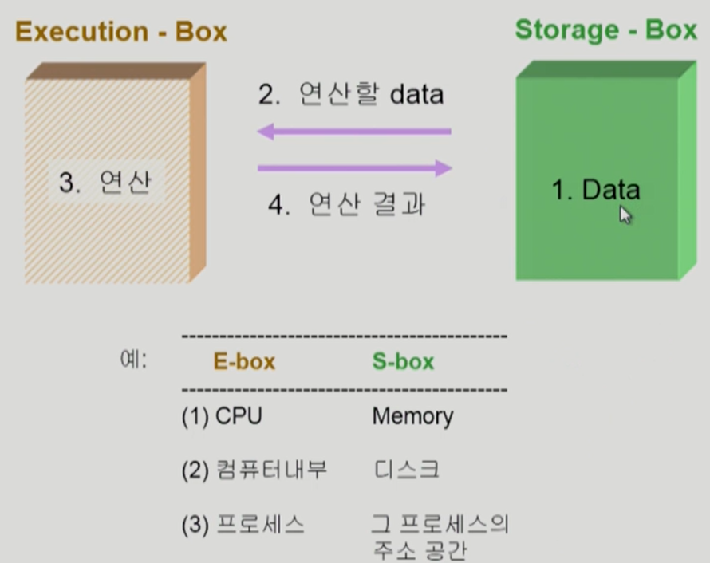

- 데이터가 저장된 위치에서 데이터를 읽어와서 연산을 한 후 그 결과를 저장된 위치에 다시 저장

- 누가 먼저 읽어왔느냐에 따라서 결과가 달라질 수 있음. 그렇게해서 생기는 문제 = Synchronization


### Race Condition

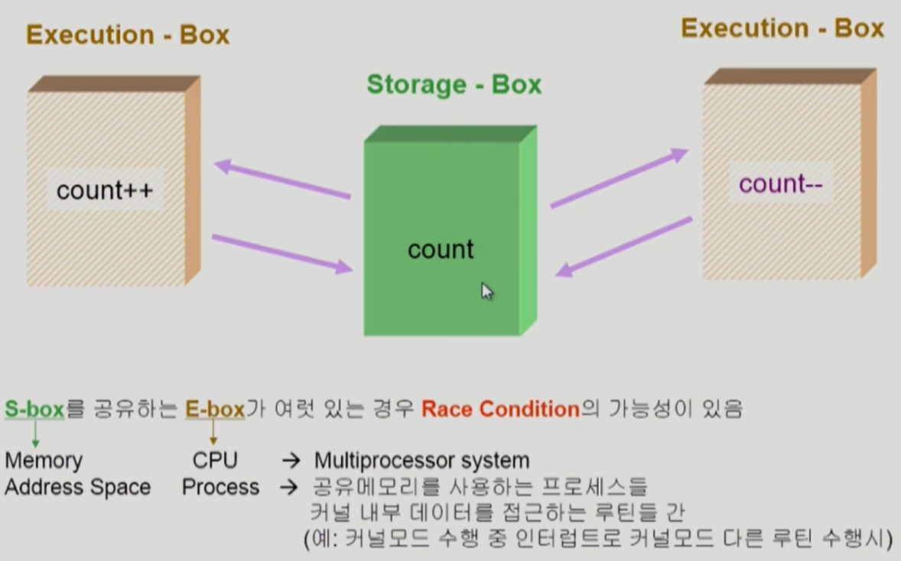

- 여러 주체가 하나의 데이터를 동시에 접근하려고 할 때를 Race Condition(경쟁상태)라고 함

- 이를 조율해주는 방법이 필요할 것

- 프로세스는 일반적인 경우라면 자기 주소공간만 접근하기 때문에  Race Condition 문제가 발생하는 경우가 없지만 본인이 직접 실행할 수 없는 부분, 운영체제에게 대신 요청해야하는 경우엔 시스템콜을 해서 커널의 코드가 실행됨. CPU를 뺏겨서 또 시스템콜을 하면  커널의 코드를 건드리기 때문에 Race Condition의 문제가 발생할 수 있음.


### OS에서 race condition은 언제 발생하는가?

1. kernel 수행 중 인터럽트 발생 시
2. Process가 system call을 하여 kernel mode로 수행 중인데 context switch가 일어나는 경우
3. Multiprocessor에서 shared memory 내의 kernel data


### OS에서의 race condition - interrupt handler v.s. kernel

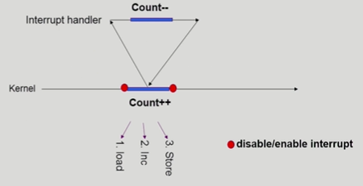

- 커널모드 running 중 interrupt가 발생하여 인터럽트 처리루틴이 수행

  => 양쪽 다 커널 코드이므로 kernel address space 공유


### If you preempt CPU while in kernel mode ...

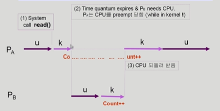

- 해결책 : 커널 모드에서 수행 중일 때는 CPU를 preempt 하지 않음, 커널 모드에서 사용자 모드로 돌아갈 때 preempt


### OS에서의 race condition - multiprocessor

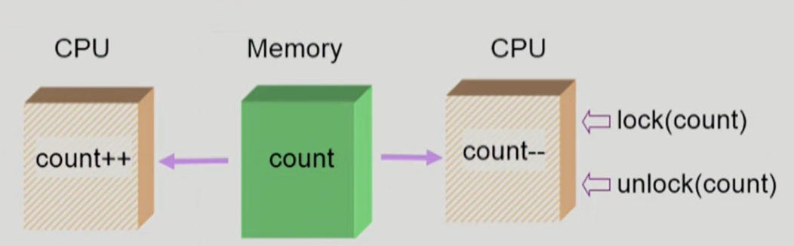

- 자주 등장하지는 않음
- 어떤 CPU가 마지막으로 count를 store했는가? -> race condition
- multiprocessor의 경우 interrupt enable/disable로 해결되지 않음
- (방법 1) 한번에 하나의 CPU만이 커널에 들어갈 수 있게 하는 방법 (비효율적아게 됨)
- (방법 2) 커널 내부에 있는 각 공유 데이터에 접근할 때마다 그 데이터에 대한 lock(다른 CPU가 접근할 수 없게 함) / unlock을 하는 방법 - 이 방식이 더 좋음


### Process Synchronization 문제

- 공유 데이터(shared data)의 동시 접근(concurrent access)은 데이터의 불일치 문제 (inconsistency)를 발생시킬 수 있다
- 일관성 (consistency) 유지를 위해서는 협력 프로세스 (cooperating process)간의 실행 순서 (orderly execution)를 정해주는 메커니즘 필요
- Race condition
  - 여러 프로세스들이 동시에 공유 데이터를 접근하는 상황
  - 데이터의 최종 연산 결과는 마지막에 그 데이터를 다룬 프로세스에 따라 달라짐
- race condition을 막기 위해서는 concurrent process는 동기화(synchronize)되어야 한다


### Example of a Race Condition

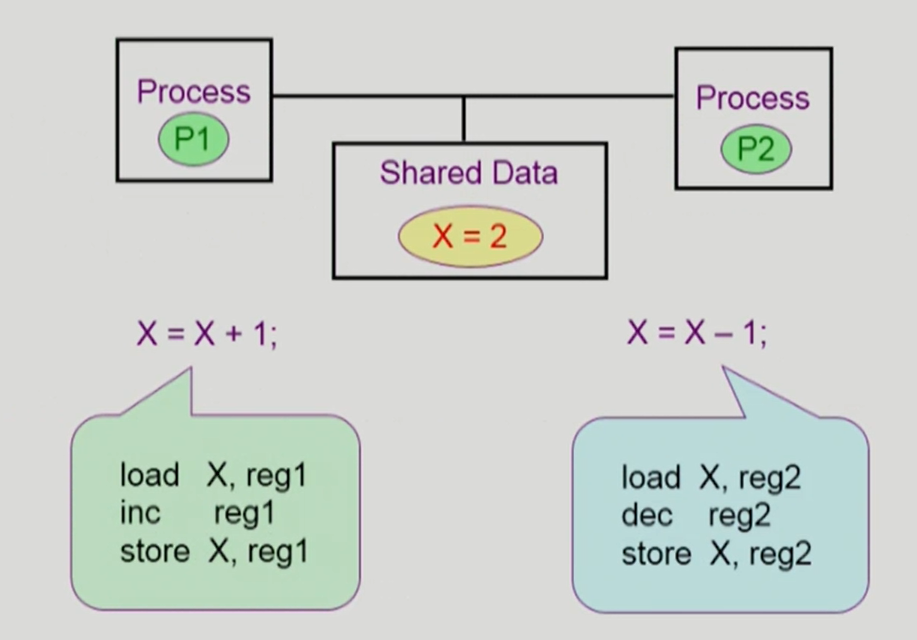

- 사용자 프로세스 P1 수행중 timer interrupt가 발생해서 context switch가 일어나서 P2가 CPU를 잡으면?
- 두 개의 프로세스가 하나의 공유 데이터에 접근해서 P1은 증가시키고 P2는 감소시키는 경우에, consistency가 깨어지는 불일치 문제 발생


### The Critical-Section Problem

- n개의 프로세스가 공유 데이터를 동시에 사용하기를 원하는 경우

- 각 프로세스의 code segment에는 공유 데이터를 접근하는 코드인 **critical section** (임계 구역)이 존재

- Problem

  - 하나의 프로세스가 critical section에 있을 때 다른 모든 프로세스는 critical section에 들어갈 수 없어야 한다

    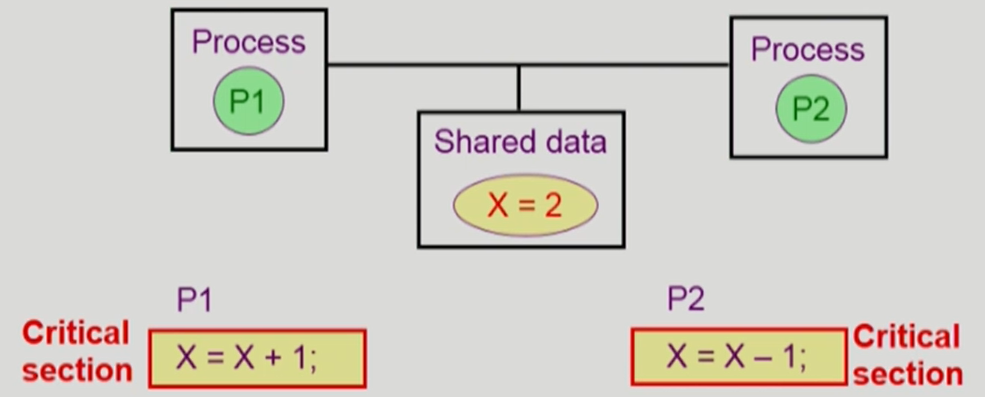


### 프로그램적 해결법의 충족 조건

- Mutual Exclusion (상호 배제)
  - 프로세스 Pi가 Critical Section 부분을 수행 중이면 다른 모든 프로세스들은 그들의 Critical Section에 들어가면 안된다
  - 배타적으로 접근해야 한다.

- Progress (진행)
  - 아무도 Critical Section에 있지 않은 상태에서 Critical Section에 들어가고자 하는 프로세스가 있으면 Critical Section에 들어가게 해줘야 한다
  - 둘 다 없는데 아무도 못들어가게 막는 경우가 있기 때문.

- Bounded Waiting (유한 대기)
  - 프로세스가 Critical Section에 들어가려고 요청한 후부터 그 요청이 허용될 때까지 다른 프로세스들이 Critical Section에 들어가는 횟수에 한계가 있어야 한다 
  - 기다리는 시간이 유한해야 한다. 특정 프로세스 입장에서 지나치게 오래 기다리면 안된다. (Starvation이 생기면 안된다)

- 가정
  - 모든 프로세스의 수행 속도는 0보다 크다
  - 프로세스들 간의 상대적인 수행 속도는 가정하지 않는다


### Initial Attempts to Solve Problem

- 두 개의 프로세스가 있다고 가정 P0, P1

- 프로세스들의 일반적인 구조

  ```c
  do {
      entry section /* 락을 걸어서 여러 프로세스가 critical section에 들어가는 것을 막음 */
      critical section
      exit section
      remainder section
  } while (1);
  ```

- 프로세스들은 수행의 동기화(synchronize)를 위해 몇몇 변수를 공유할 수 있다 -> synchronization variable


### Algorithm 1

- Synchronization variable

  int turn;

  initially turn = 0; => Pi can enter its critical section if (turn == i)

- Process P0

  ```c
  do {
      while (turn != 0);  /* My turn? */
      critical section
      turn = 1;           /* Now it's your turn */
      remainder section
  } while (1);
  ```

  - 본인 차례가 아닌 동안 while문을 돌면서 기다리고 차례가 되면 critical section에 들어감. 상대방이 빠져나가면 turn이 돌아서 자기 차례가 되어 들어감

  Satisfies mutual exclusion, but not progress

  즉, 과잉양보: **반드시 한번씩 교대로 들어가야만 함** (swap-turn)

  그가 turn을 내값으로 바꿔줘야만 내가 들어갈 수 있음

  특정 프로세스가 더 빈번히 critical section을 들어가야 한다면?

  - 상대방이 turn을 바꿔주지 않기 때문에 영원히 못 들어가게 됨. (progress 조건을 만족하지 못함)


### Algorithm 2

- Synchronization variables

  - boolean flag[2];

    initially flag[모두] = false; /* no one is in CS */

  - "Pi ready to enter its critical section" if (flag [i] == true)

- Process Pi

  ```c
  do {
      flag[i]=true;  /* Pretend I am in 들어간다는 의사 표시*/
      while (flag[i]); /* Is he also in? then wait 상대방도 의사표시 하고 있다면 기다림*/
      critical section
     	flag[i] = false; /* I am out now 상대방이 기다리고 있으면 들어갈 수 있게 표시*/
      remainder section
  } while (1);
  ```

- Satisfies mutual exclusion, but not progress requirement.

- 둘 다 2행까지 수행 후 끊임 없이 양보하는 상황 발생 가능 (둘다 True인 상태이고, 일단 들어가야 깃발을 내려놓을 수가 있어짐 아무도 못 들어감)


### Algorithm 3 (Peterson's Algorithm)

- Combined synchronization variables of algorithms 1 and 2.

- Process Pi

  ```c
  do {
          flag[i] = true;  /* My intention is to enter ...깃발 들어서 의사표시 */
      	turn = j;        /* Set to his turn turn을 상대방에게 바꿔놓음 */
          while (flag[i] && turn == j); /* wait only if ... 상대방이 깃발 들고, 상대방 차례면 기다림*/
          critical section
          flag[i] = false; 
          remainder section
  	} while (1);
  ```

- Meets all three requirements; solves the critical section problem for two processes.(세 가지 조건을 모두 만족하는 코드임)

- Busy Waiting! (=spin lock) (계속 CPU와 memory를 쓰면서 wait) - 이미 들어가 있는 상태에서 CPU를 잡으면 할당 시간 동안까지 계속 체크함. 상대방을 체크하지 않고 쓸데 없이 본인의 할당 시간을 while문에서 소비하고 반납하게 됨. (비효율적인 방법)


### Synchronization Hardware

- 하드웨어적으로 Test & modify를 atomic하게 수행할 수 있도록 지원하는 경우 앞의 문제는 간단히 해결

  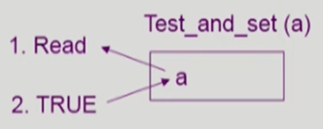

  - a가 원래 0이었다면 0이 읽히고 1로 바뀜
  - Test_and_set(a)는 읽고 바꾸는 것을 atomic하게 수행함

- Mutual Exclusion with Test & Set

  ```c
  Synchronization variable:
  	boolean lock = false;
  Process Pi
      	do {
              while (Test_and_Set(lock));
              critical section
              lock = false;
              remainder section
          }
  ```

  

### Semaphores

- 앞의 방식들을 추상화시킴

- 공유자원을 획득하고 반납하는 것을 처리해줌

- Semaphore S

  - integer variable

  - 아래의 두 가지 atomic 연산에 의해서만 접근 가능

    ```c
    P(S): 	while (S<=0) do no-op; /* -> i.e. wait */
    		S--;
    ```

    - 공유자원을 획득하는 과정 (lock) - 자원이 있으면 가져가고 없으면 while문에서 대기

    if positive, decrement-&-enter.

    Otherwise, wait until positive (busy-wait)

    ```c
    V(S):
    		S++;
    ```

    - 자원을 반납하는 과정 (un-lock)


### Critical Section of n Processes

```c
Synchronization variable:
semaphore mutex; /* initially 1: 1개가 CS에 들어갈 수 있다 */

Process Pi
do {
	P(mutex); /* if positive, dec-&-enter, Otherwise, wait. */
	critical section
    V(mutex); /*Increment semaphore */
    remainder section
    }
```

busy-wait은 효율적이지 못함(=spin lock)

Block & Wakeup 방식의 구현 (=sleep lock)


### Block / Wakeup Implementation

- Semaphore를 다음과 같이 정의

  ```c
  typedef struct
  {	int value; /* semaphore */
  	struct process *L; /* process wait queue */
  } semaphore;
  ```

- block과 wakeup을 다음과 같이 가정

  - block 

    - 커널은 block을 호출한 프로세스를 suspend 시킴
    - 이 프로세스의 PCB를 semaphore에 대한 wait queue에 넣음

  - wakeup(P)

    - block된 프로세스 P를 wakeup 시킴

    - 이 프로세스의 PCB를 ready queue로 옮김

      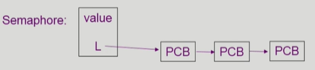


### Implementation - Block / Wakeup version of P() & V()

- Semaphore 연산이 이제 다음과 같이 정의됨

  ```c
  P(S): 	S.value--; /* prepare to enter */
  		if (S.value < 0){ /* Oops, negative, I cannot enter 자원의 여분이 없음 */
              	add this process P to S.L;
              	block(); /* block되어 있다가 자원이 생기면 깨어날 수 있음 */
          }
  ```

  ```c
  V(S):	S.value++;
  		if (S.value <= 0){
              	remove a process P from S.L;
              	wakeup(P); /* 잠들어 있는 연산이 있으면 깨워줌 */
          }
  ```

  

### Which is better?

- Busy-wait v.s. Block/wakeup
- Block/wakeup overhead v.s. Critical section 길이
  - Critical section의 길이가 긴 경우 Block/Wakeup이 적당
  - Critical section의 길이가 매우 짧은 경우 Block/Wakeup 오버헤드가 busy-wait 오버헤드보다 더 커질 수 있음
  - 일반적으로는 Block/Wakeup 방식이 더 좋음


### Deadlock and Starvation

- Deadlock

  - 둘 이상의 프로세스가 서로 상대방에 의해 충족될 수 있는 event를 무한히 기다리는 현상

- S와 Q가 1로 초기화된 semaphore라 하자.

  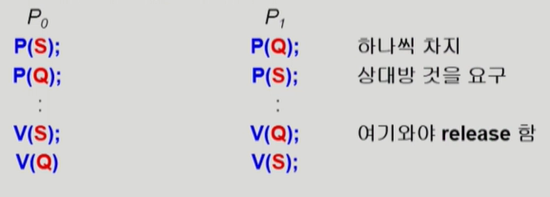

  - S와 Q는 배타적. Q를 쓴 이후에 S를 내놓는 데 상대방을 기다리면서 영원히 자기 것은 내어놓지 않음

  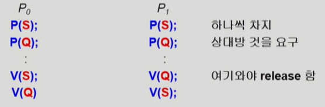

  - 자원을 획득하는 순서를 똑같이 맞춰주면 데드락 해결 가능

- Starvation

  - indefinite blocking. 프로세스가 suspend된 이유에 해당하는 세마포어 큐에서 빠져나갈 수 없는 현상
  - 자원을 얻지 못하고 무한히 기다리는 것 (데드락도 일종의 스타베이션으로 볼 수 있음)


### Classical Problems of Synchronization (고전적인 문제)

- Bounded-Buffer Problem (Producer-Consumer Problem)
- Readers and Writers Problem
- Dining-Philosophers Problem


### Bounded-Buffer Problem (Producer-Consumer Problem)

- 임시로 데이터를 저장하는 공간(Buffer)이 유한한 환경에서의 생산자-소비자 문제
- Producer 프로세스, Consumer 프로세스가 여러개 존재
- 생산자 : 공유 버퍼에 데이터를 하나 만들어서 집어 넣는 역할(주황색: 데이터가 들어있는 버퍼, 나머지는 비어있는 버퍼)
- 소비자 : 데이터를 하나씩 꺼내 쓰는 역할

- 버퍼가 유한하기 때문에 생기는 문제: 생산자 입장에서는 사용할 자원이 없는 것이 됨. 소비자가 나타나서 내용을 꺼내가야 빈 버퍼가 생길 때가지 생산자는 기다려야 함. 소비자 입장에서는 꺼내갈 것이 없어서, 생산자가 내용을 만들어서 넣어줄 때까지 기다려야 함
- 둘이 동시에 공유 버퍼에 접근하는 것을 막기 위해 lock을 걸어 배타적 접근을 하도록 함. 가용 자원을 세는 변수가 필요함

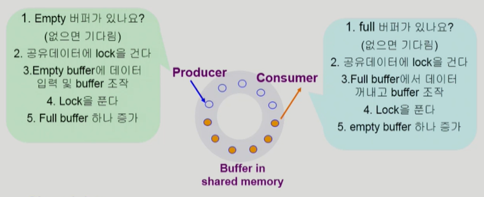

- Shared data
  - buffer 자체 및 buffer 조작 변수(empty/full buffer의 시작 위치)
- Synchronization variables
  - mutual exclusion -> Need binary semaphore (shared data의 mutual exclusion을 위해)
  - resource count -> Need integer semaphore (남은 full/empty buffer의 수 표시)


### Bounded-Buffer Problem

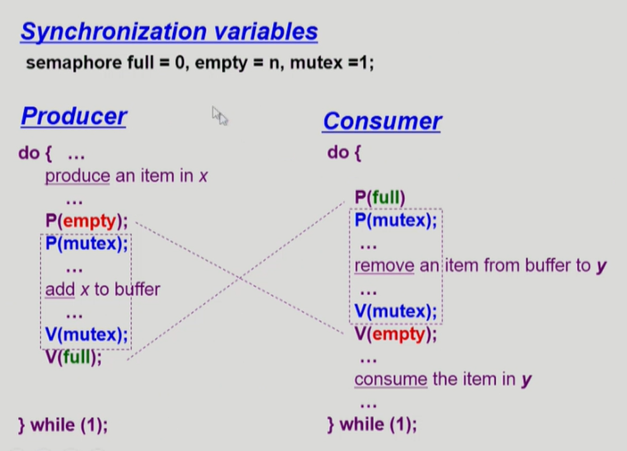

- 공유 버퍼: n개


### Reader-Writers Problem

- 한 프로세스가 db에 write 중일 때 다른 process가 접근하면 안됨
- read는 동시에 여럿이 해도 됨
- Solution
  - Writer가 db에 접근 허가를 아직 얻지 못한 상태에서는 모든 대기중인 reader들을 다 db에 접근하게 해준다
  - Writer는 대기중인 reader가 하나도 없을 때 db접근이 허용된다
  - 일단 writer가 db에 접근중이면 reader들은 접근이 금지된다
  - Writer가 db에서 빠져나가야만 reader의 접근이 허용된다

- Shared data
  - DB 자체
  - readcount; /* 현재 DB에 접근 중인 Reader의 수 */

- Synchronization variables
  - mutex /* 공유 변수 readcount를 접근하는 코드(critical section)의 mutual exclusion 보장을 위해 사용 */
  - db /* Reader와 writer가 공유 DB 자체를 올바르게 접근하게 하는 역할 */


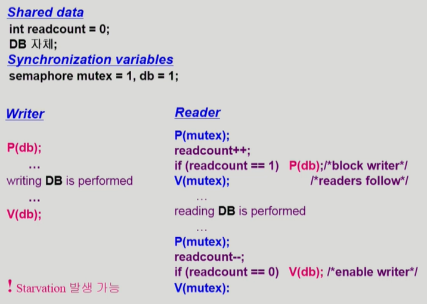


### Dining-Philosophers Problem

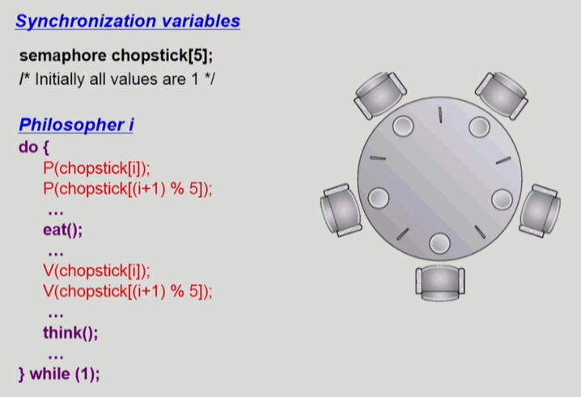

- 다섯명의 철학자가 생각하는 시간과 밥 먹는 시간이 다름. 젓가락 두 개를 다 잡아야 함.

- 공유 자원이기 때문에 옆에 있는 철학자가 잡고 있으면 못 잡고 기다려야 됨.

- 앞의 solution의 문제점

  - Deadlock의 가능성이 있다
  - 모든 철학자가 동시에 배가 고파져 왼쪽 젓가락을 집어버린 경우

- 해결 방안

  - 4명의 철학자만이 테이블에 동시에 앉을 수 있도록 한다
  - 젓가락을 두 개 모두 집을 수 있을 때에만 젓가락을 집을 수 있게 한다
  - 비대칭
    - 짝수(홀수) 철학자는 왼쪽(오른쪽) 젓가락부터 집도록

  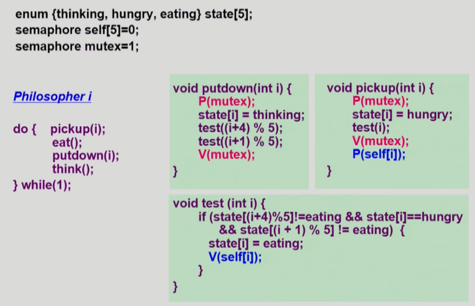


### Monitor

p연산과 v연산을 통해 프로세스 동기화를 하지만, 모니터는 동기화할 수 있는 방법을 프로그램에 알려주고 프로그램이 그것을 하는 것.

- Semaphore의 문제점

  - 코딩하기 힘들다
  - 정확성 (correctness)의 입증이 어렵다
  - 자발적 협력(voluntary cooperation)이 필요하다
  - 한 번의 실수가 모든 시스템에 치명적 영향 (동기화가 깨짐)

- 예

  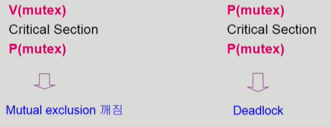

- 동시 수행중인 프로세스 사이에서 abstract data type의 안전한 공유를 보장하기 위한 high-level synchronization construct

  - 프로그램 안에서 동시접근하는 문제를 모니터가 자동으로 해결해줘서 프로그래머의 부담을 확연히 줄여줌

  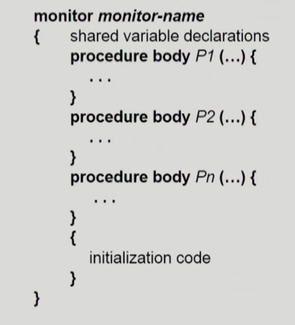


- 모니터 내에서는 **한번에 하나의 프로세스만**이 활동 가능

- 프로그래머가 동기화 제약 조건을 명시적으로 코딩할 필요가 없음

- 프로세스가 모니터 안에서 기다릴 수 있도록 하기 위해 **condition variable** 사용

  **condition x, y;**

- Condition variable 은 wait과 signal연산에 의해서만 접근 가능.

  **x.wait();**

  x.wait()을 invoke한 프로세스는 다른 프로세스가 x.signal()을 invoke 하기 전까지 suspend된다

  **x.signal();** (깨우기)

  x.signal()은 정확하게 하나의 suspend된 프로세스를 resume한다.

  Suspend된 프로세스가 없으면 아무 일도 일어나지 않는다

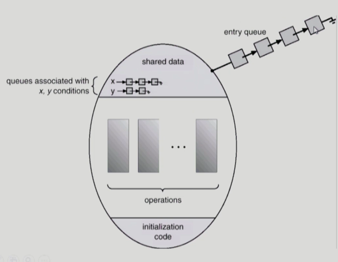

​	모니터가 알아서 제어해주기 때문에 굳이 들어가기 전에 lock을 걸고 나올 때 lock을 풀 이유가 없어짐. 


### Bounded-Buffer Problem

공유 버퍼에 대해서 락을 걸거나 푸는 코드가 필요 없음

full은 내용이 들어있는 버퍼 empty는 빈 버퍼를 기다리는 컨디션

내용이 들어있는 버퍼를 기다리면서(소비자 버퍼) 잠들어있는 버퍼가 있으면 깨어줘라.

세마포어보다 모니터버전이 훨씬 더 자연스러움

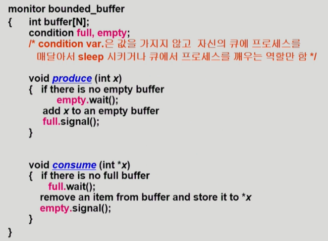

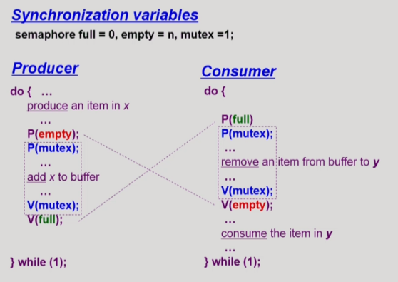

세마포어에서는 lock을 거는 코드가 있고, 모니터 버전에서는 없음

빈 버퍼가 없으면 잠들게 해라 라는 코드가 있으나 세마포어에서는 P연산을 해줌

모니터에서는 시그널 연산, 세마포어에서는 V연산

세마포어에서는 V연산을 해주면 내용이 들어있는 버퍼를 기다리는 소비자가 있으면 깨어주는 역할을 해야하고, 값을 가지면 V연산은 값의 변화가 항상 있으나 모니터에서는 잠들어있는 프로세스가 있으면 그냥 깨워라는 것이기때문에, 잠들어있는 프로세스가 없으면 값을 바꾸거나 아무 일도 발생하지 않음.


### Dining Pilosophers Example - Monitor ver

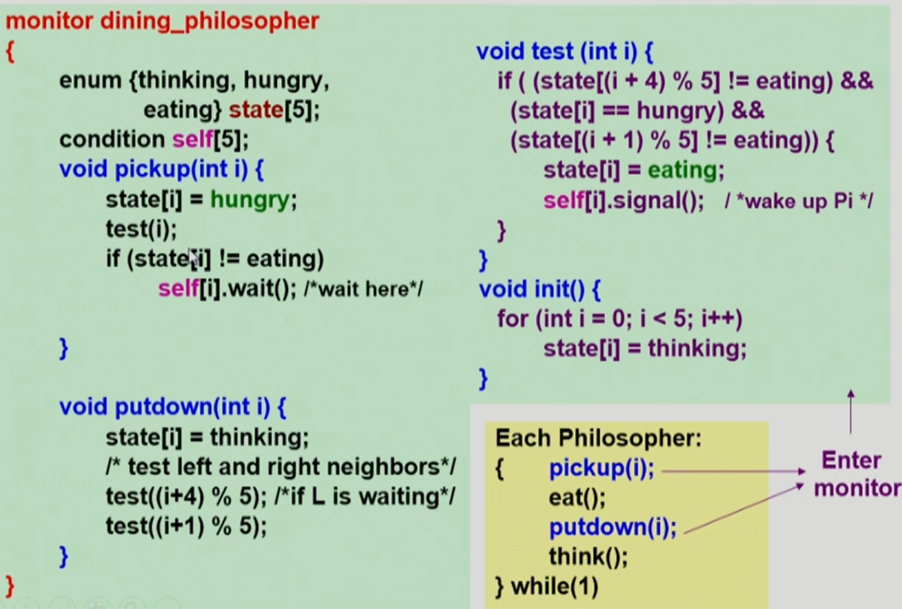

