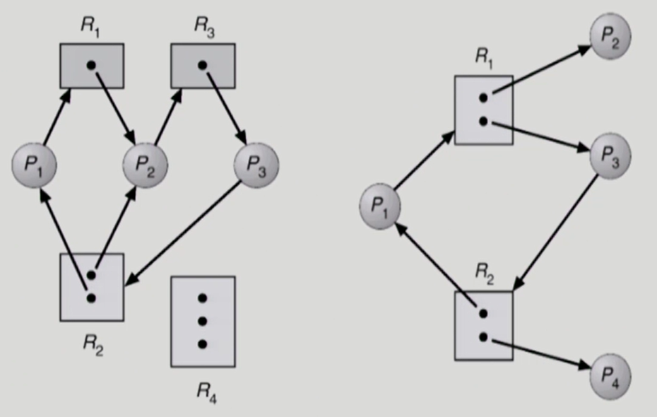
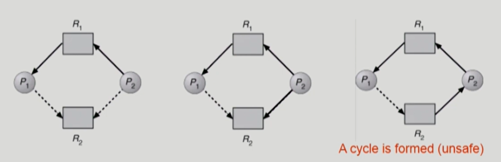
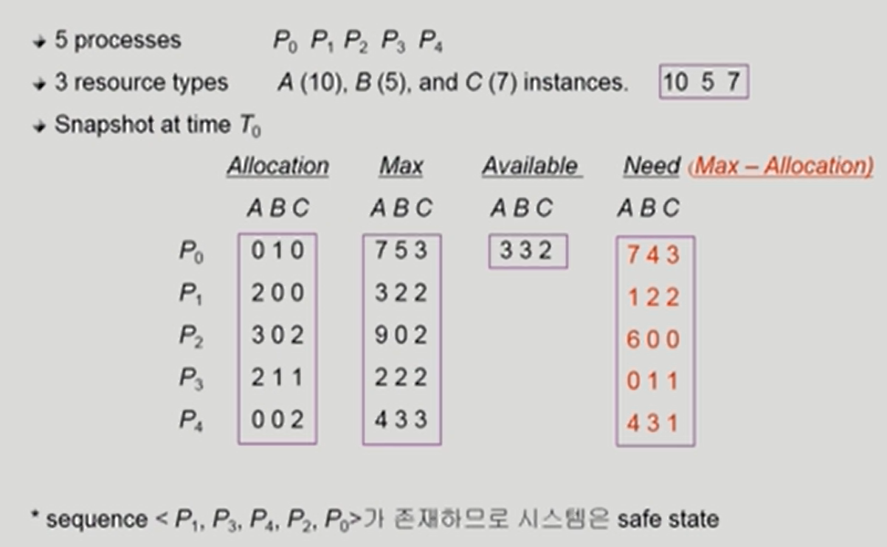
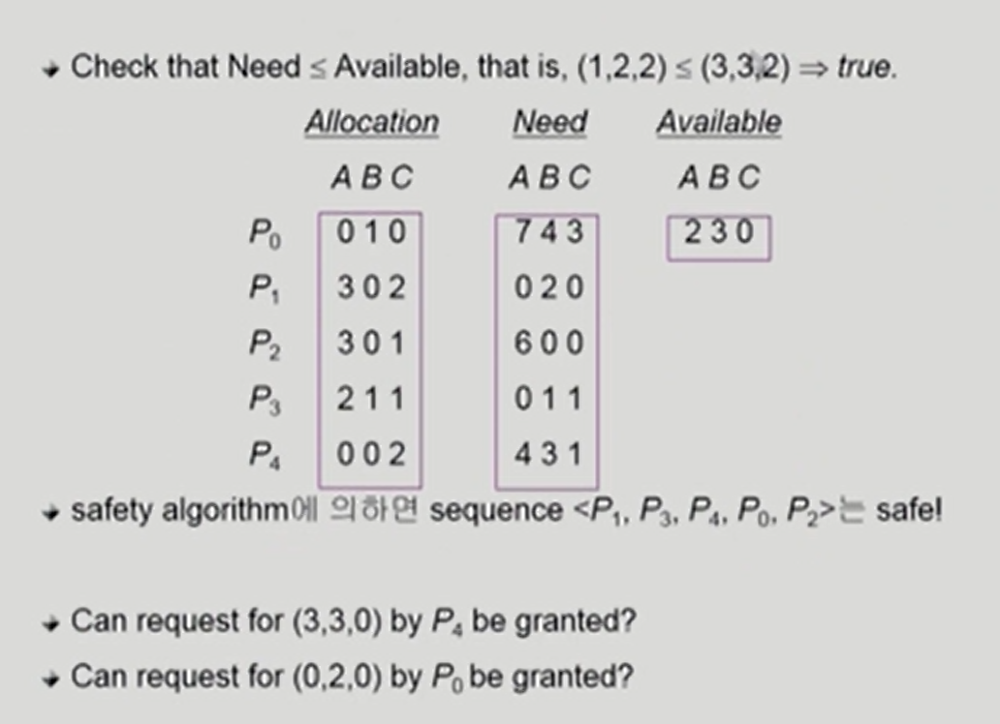
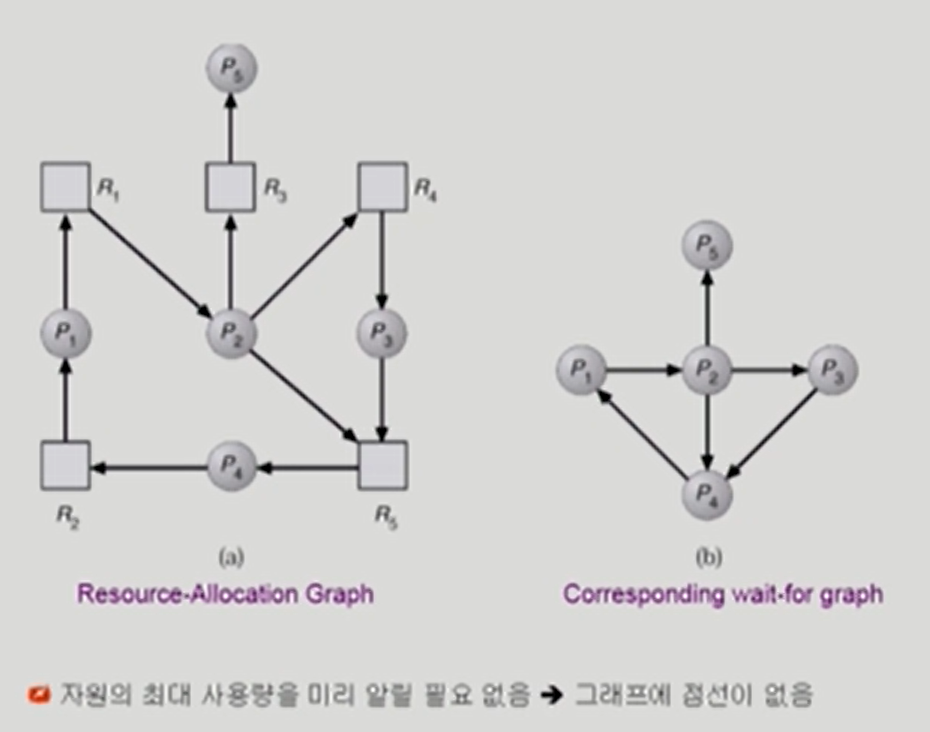
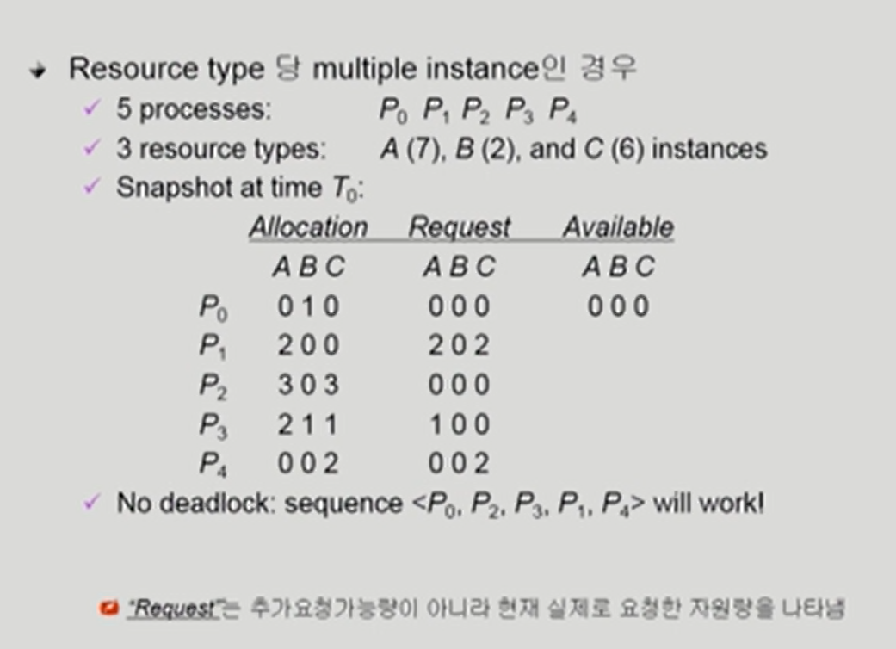
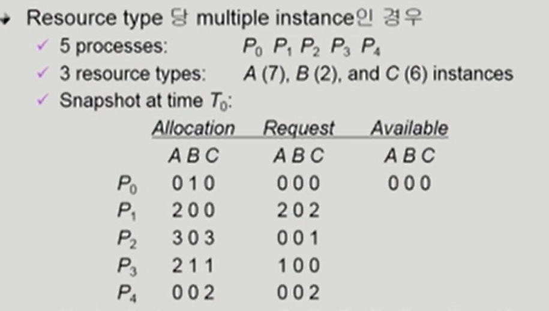

# Chapter 7. Deadlocks

### 교착상태 (deadlock)

### The Deadlock Problem

- Deadlock
  - 일련의 프로세스들이 서로가 가진 자원을 기다리며 block된 상태
- Resource (자원)
  - 하드웨어, 소프트웨어 등을 포함하는 개념
  - (예) I/O device, CPU cycle, memory space, semaphore 등
  - 프로세스가 자원을 사용하는 절차
    - Request, Allocate, Use, Release
- Deadlock Example 1
  - 시스템에 2개의 tape drive가 있다 
  - 프로세스 P1과 P2 각각이 하나의 tape drive를 보유한 채 다른 하나를 기다리고 있다 (보유한 채 상대방의 자원을 계속 요구하면 어느 누구도 진행이 되지 않음)
- Deadlock Example 2
  - Binary semaphores A and B

P0		P1

P(A);	P(B);

P(B);	P(A);

두 개의 프로세스가 하나씩 획득하고 나머지를 획득하고 싶어하는데, cpu가 누구에게 가더라도 해결이 안되기때문에 데드락 상태 발생

### Deadlock 발생의 4가지 조건

4가지 조건을 모두 만족해야 함, 하나라도 만족하지 않으면 데드락이 발생하지 않음

- Mutual exclusion (상호 배제)

  - 매 순간 하나의 프로세스만이 자원을 사용할 수 있음
  - **독점적**으로 써야만 함

- No preemption (비선점)

  - 프로세스는 자원을 스스로 내어놓을 뿐 강제로 **빼앗기지 않음**
  - 자원을 가지고 있는데 빼앗길 수 있다고 하면 데드락이 발생하지 않음

- Hold and wait (보유대기)

  - 자원을 가진 프로세스가 **다른 자원을 기다릴 때** **보유 자원을 놓지 않고** 계속 가지고 있음

- Circular wait (순환대기)

  - 자원을 기다리는 프로세스 간에 사이클이 형성되어야 함

  - 프로세스 P0, P1, ... Pn이 있을 때

    P0은 P1이 가진 자원을 기다림

    P1은 P2이 가진 자원을 기다림

    Pn-1은 Pn이 가진 자원을 기다림

    Pn은 P0이 가진 자원을 기다림
    
  - 필요로하는 자원이 꼬리를 물고, 서로가 가진 자원을 기다리면서 사이클을 형성하는 경우

### Resource-Allocation Graph (자원할당그래프)

데드락이 발생했는지 확인하는 그래프

자원 -> 프로세스 : 프로세스가 이 자원을 가지고 있다는 의미

프로세스 -> 자원: 프로세스가 이 자원을 요청하고 있다는 의미, 요청만 하고 아직 얻지는 못함

- Vertex
  - Process P = {p1, P2, ... Pn}
  - Resource R = {R1, R2, ..., Rm}
  
- Edge
  - request edge Pi -> Pj
  
  - assignment edge Rj -> Pi
  
    
  
    사이클이 있음
  
    1번 그림: p1은 자원 2를 가지면서 자원1을 요청, p2는 자원1,2를 가지고 있으면서 자원3을 요청, p3은 자원3을 가지고 있으면서 자원2를 요청 -> 데드락 상황
  
    2번 그림: p1이 자원2를 가지고 있고 자원1을 요청, p3이 자원1을 가지고 자원2를 요청하는데 여분이 하나씩 있고, 이 자원은 p2와 p4가 하나씩 가지고 사이클에 연루되어 있지 않기 때문에 쓰고 나서 반납하면 available 해져서 데드락이 아님

​				사이클이 없음

- 그래프에 cycle이 없으면 deadlock이 아니다
- 그래프에 cycle이 있으면 (데드락일수도 있고, 아닐수도 있다)
  - if only one instance per resource type, then deadlock (자원의 인스턴스가 하나씩밖에 없을 때)
  - if several instances per resource type, possibility of deadlock  (자원의 인스턴스가 여러개 있을 때 데드락일수도 있고 아닐수도 있음)

### Deadlock의 처리 방법

- Deadlock Prevention
  - 자원 할당 시 Deadlock의 4가지 필요 조건 중 어느 하나가 만족되지 않도록 하는 것
- Deadlock Avoidance
  - 자원 요청에 대한 부가적인 정보를 이용해서 deadlock의 가능성이 없는 경우에만 자원을 할당
  - 시스템 state가 원래 state로 돌아올 수 있는 경우에만 자원 할당

=> 데드락이 생기지 않도록 원천적으로 방지하는 방법 (위로 갈수록 데드락 처리방법이 강함)

- Deadlock Detection and recovery
  - Deadlock 발생은 허용하되 그에 대한 detection 루틴을 두어 deadlock 발견 시 recover
  - 느려지거나 문제가 발생하면 데드락이 있는지 확인하고 있으면 recover
- Deadlock Ignorance
  - Deadlock을 시스템이 책임지지 않음
  - UNIX를 포함한 대부분의 OS가 채택
  - 아무 일도 하지 않음

=> 데드락이 생기도록 놔둠. 관여하지 않음

데드락은 빈번히 발생하는 문제가 아니기 때문에 미연에 방지하기 위해서 무언가 하는 것이 비효율적일 수 있어서 주로 생겨도 아무 일도 하지 않는 것이 많이 쓰임

### Deadlock Prevention

- Mutual Exclusion (상호 배제)
  - 공유해서는 안되는 자원의 경우 반드시 성립해야 함
  - 막을 수 있는 조건이 아님. 
- Hold and wait (보유대기)
  - 프로세스가 자원을 요청할 때 다른 어떤 자원도 가지고 있지 않아야 한다
  - 방법 1. 프로세스 시작 시 모든 필요한 자원을 할당받게 하는 방법 (자원에 대한 비효율성이 생길 수 있음)
  - 방법 2. 자원이 필요할 경우 보유 자원을 모두 놓고 다시 요청 
  - 자진해서 반납함으로써 문제 해결
- No preemption (비선점)
  - process가 어떤 자원을 기다려야 하는 경우 이미 보유한 자원이 선점됨
  - 모든 필요한 자원을 얻을 수 있을 때 그 프로세스는 다시 시작된다
  - State를 쉽게 save하고 restore할 수 있는 자원에서 주로 사용 (CPU, memory)
    - CPU는 빼앗기면 다음 시점부터 실행 가능. 
  - 빼앗아 올 수 있도록 preemption이 가능할 수 있도록 하면 데드락이 생기지 안흠
- Circular wait (순환대기)

  - 모든 자원 유형에 할당 순서를 정하여 정해진 순서대로만 자원 할당
  - 예를 들어 순서가 3인 자원 Ri를 보유 중인 프로세스가 순서 1인 자원 Rj을 할당받기 위해서는 우선 Ri를 release해야 한다
  - 낮은 순서의 자원을 먼저 획득해야만 다음 자원을 얻을 수 있게 함
  

=> Utilization 저하, throughput 감소, starvation 문제 (자원에 대한 이용률이 낮아지고 성능이 나빠지고 starvation의 문제가 발생할 수 있다.)

### Deadlock Avoidance

- Deadlock Avoidance
  - 자원 요청에 대한 부가정보를 이용해서 자원 할당이 deadlock으로부터 **안전(safe)한지를 동적으로 조사해서 안전한 경우에만 할당**
  - 가장 단순하고 일반적인 모델은 프로세스들이 필요로 하는 각 **자원별 최대 사용량을 미리 선언하도록 하는 방법임** (프로세스 시작할 때 처음부터 미리 사용량을 정해줌)
- safe state
  - 시스템 내의 프로세스들에 대한 safe sequence가 존재하는 상태
- safe sequence
  - 프로세스의 sequence <P1, P2, ..., Pn>이 safe하려면 Pi(1<=i<=n)의 자원 요청이 "가용 자원 + 모든 Pj (j<i)의 보유 자원"에 의해 충족되어야 함
  - 조건을 만족하면 다음 방법으로 모든 프로세스의 수행을 보장
    - Pi의 자원 요청이 즉시 충족될 수 없으면 모든 Pj(j<i)가 종료될 때까지 기다린다
    - Pi-1이 종료되면 Pi의 자원 요청을 만족시켜 수행한다

- 시스템이 safe state에 있으면 => no deadlock
- 시스템이 unsafe state에 있으면 => possibility of deadlock
- Deadlock Avoidance
  - 시스템이 unsafe state에 들어가지 않는 것을 보장
  - 2가지 경우의 avoidance 알고리즘
    - Single instance per resource types 자원 당 인스턴스가 하나밖에 없는 경우
      - Resource Allocation Graph algorithm 사용
    - Multiple instance per resource types 자원 당 인스턴스가 여러개 있는 경우
      - Banker's Algorithm 사용

### Resource Allocation Graph algorithm

- Claim edge Pi -> Rj
  - 프로세스 Pi가 자원 Rj를 미래에 요청할 수 있음을 뜻함 (점선으로 표시)
  
    (평생에 한번은 자원을 요청할 수 있다는 것을 표시함)
  
  - 프로세스가 해당 자원 요청시 request edge로 바뀜 (실선)
  
  - Rj가 release되면 assignment edge는 다시 claim edge로 바뀐다
  
- request edge의 assignment edge 변경시 (점선을 포함하여) cycle이 생기지 않는 경우에만 요청 자원을 할당한다

- Cycle 생성 여부 조사시 프로세스의 수가 n일 때 O(n^2) 시간이 걸린다

  

​		데드락이 아님 => P1이 2번자원을 요청할 수 있지만 아직 요청한 것이 아니므로. 

요청을 해서 사이클이 생성되면 데드락이 될 수도 있음. 데드락이 발생할 수 있는 위험성 있는 상황은 방지를 해서 자원을 주지 않음 (Deadlock Avoidance)

### Banker's Algorithm

- 가정
  - 모든 프로세스는 자원의 최대 사용량을 미리 명시
  - 프로세스가 요청 자원을 모두 할당받은 경우 유한 시간 안에 이들 자원을 다시 반납한다
- 방법
  - 기본 개념: 자원 요청시 safe 상태를 유지할 경우에만 할당
  - 총 요청 자원의 수가 가용 자원의 수보다 적은 프로세스를 선택
    (그런 프로세스가 없으면 unsafe 상태)
  - 그런 프로세스가 있으면 그 프로세스에게 자원을 할당
  - 할당받은 프로세스가 종료되면 모든 자원을 반납
  - 모든 프로세스가 종료될 때까지 이러한 과정 반복

### Example of Banker's Algorithm

### P1 request (1, 0, 2)

### Deadlock Detection and Recovery

- Deadlock Detection
  - Resource type 당 single instance인 경우
    - 자원할당 그래프에서의 cycle이 곧 deadlock을 의미
  - Resource type 당 multiple instance인 경우
    - Banker's algorithm과 유사한 방법 활용
- Wait-for graph 알고리즘
  - Resource type 당 single instance인 경우
  - Wait-for graph
    - 자원할당 그래프의 변형
    - 프로세스만으로 node 구성
    - Pj가 가지고 있는 자원을 Pk가 기다리는 경우 Pk -> Pj
  - Algorithm
    - **Wait-for graph에 사이클이 존재하는지를 주기적으로 조사**
    - O(n^2)

=> 데드락이 없는 상황

P2의 Request 001 인 경우 -> 데드락이 있음

- Recovery
  - Process termination (프로세스 종료)
    - Abort all deadlocked processes (데드락이 연루된 모든 프로세스를 죽임)
    - Abort one process at a time until the deadlock cycle is eliminated (데드락이 연루된 프로세스를 하나씩 죽여봄 데드락이 없어질 때까지 하나씩 죽여감)
  - Resource Preemption (프로세스에게 자원을 뺏음)
    - 비용을 최소화할 victim의 선정 (자원을 뺏을 프로세스를 선정)
    - safe state로 rollback하여 process를 restart
    - Starvation 문제
      - 동일한 프로세스가 계속해서 victim으로 선정되는 경우 (패턴을 조금씩 바꿔야 함)
      - cost factor에 rollback 횟수도 같이 고려

### Deadlock Ignorance 

- Deadlock이 일어나지 않는다고 생각하고 아무런 조치도 취하지 않음
  - Deadlock이 매우 드물게 발생하므로 deadlock에 대한 조치 자체가 더 큰 overhead일 수 있음
  - 만약, 시스템에 deadlock이 발생한 경우 시스템이 비정상적으로 작동하는 것을 사람이 느낀 후 직접 process를 죽이는 등의 방법으로 대처
  - UNIX, Windows 등 대부분의 범용 OS가 채택

