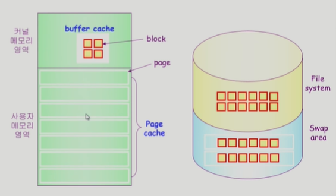

# Chapter 11. File Systems Implementation

### Allocation of File Data in Disk

- 디스크에 파일을 저장할 때의 방법

- Contiguous Allocation
- Linked Allocation
- Indexed Allocation

### Contiguous Allocation

- 연속적인 메모리에 올리는 방법
- 단점
  - external fragmentation (외부 단편화 발생)
  - File grow가 어려움 (수정 등으로 인해 파일의 크기가 변하는 것)
    - file 생성시 얼만큼의 hole를 배당할 것인가?
    - grow 가능 vs 낭비 (Internal fragmentation)
- 장점
  - Fast I/O
    - 한 번의 seek/rotation으로 많은 바이트 transfer 가능
    - Realtime file 용으로, 또는 이미 run 중이던 process의 swapping 용
  - Direct access (=random access) 가능

### Linked Allocation

- 각 블록이 다음 블록의 주소를 가지고 있다. 디렉토리는 파일의 시작과 끝 위치만 가지고 있다.
- 장점
  - external fragmentation (외부 단편화) 발생 안 함
- 단점
  - No random access
  - Reliability 문제
    - 한 sector가 고장나 pointer가 유실되면 많은 부분을 잃음
  - Pointer를 위한 공간이 block의 일부가 되어 공간 효율성을 떨어뜨림
    - 보통 512바이트(배수)로 저장됨.
    - 512 bytes/sector, 4 bytes/pointer (사실상 데이터를 저장할 수 있는 위치는 512-4 = 508 bytes)
    - 만약 512 bytes file을 저장하려면 2 sector에 저장해야 함
- 변형
  - File Allocation Table(FAT) 파일 시스템
    - 포인터를 별도의 위치에 보관하여 reliability와 공간효율성 문제 해결

### Indexed Allocation

- Index block을 두어 파일의 내용을 가지고 있는 주소를 저장해둔다.
- 그림의 경우 총 5개의 블록으로 이루어져 있다.
- 장점
  - 외부 단편화가 발생하지 않는다.
  - Direct access 가능
- 단점
  - Small file의 경우 공간 낭비 (실제로 많은 file이 small)
    - 저장하는데 두 섹터나 필요함
  - Too large file의 경우 하나의 block으로는 index를 저장하기에 부족
    - 해결 방안
      1. linked scheme : index block의 실제 위치를 적다가 실제 파일의 위치가 아니라 또다른 블록의 인덱스를 표시
      2. multi-level index (2단계 페이지를 사용하듯이  함)

### UNIX 파일시스템의 구조

- 유닉스 파일 시스템의 중요 개념
  - Boot block
    - 부팅에 필요한 정보 (bootstrap loader)
  - Super block
    - 파일 시스템에 관한 총체적인 정보를 담고 있다.
  - Inode
    - 파일 이름을 제외한 파일의 모든 meta data를 저장
  - Data block
    - 파일의 실제 내용을 보관

### FAT File system

### Free-Space Management

- Bit map or bit vector

  

  - bit map은 부가적인 공간을 필요로 함

  - 연속적인 n개의 free block을 찾는데 효과적이다.

- Linked List

  - 모든 free block들을 링크로 연결(free list)

  - 연속적인 가용공간을 찾는 것은 쉽지 않다.

  - 공간의 낭비가 없다.

- Grouping

  - linked list 방법의 변형

  - 첫 번째 free block이 n개의 pointer를 가짐

    - n-1 pointer는 free data block을 가리킴
    - 마지막 pointer가 가리키는 block은 또 다시 n pointer를 가짐

    

- Counting

  - 프로그램들이 종종 여러 개의 연속적인 block을 할당하고 반납한다는 성질에 착안

  - (first free block, # of contiguous free blocks)를 유지

### Linked Free Space List on Disk

### Directory Implementation

- Linear list

  - <file name, file metadata> 의 list

  - 구현이 간단

  - 디렉토리 내에 파일이 있는지 찾기 위해서는 linear search가 필요 ( time consuming)

- Hash Table

  - linear list + hashing

  - Hash table은 file name을 이 파일의 linear list의 위치로 바꾸어줌

  - search time을 없앰

  - Collision 발생 가능

  

- File metadata의 보관 위치

  - 디렉토리 내에 직접 보관

  - 디렉토리에는 포인터를 두고 다른 곳에 보관
    - Inode, FAT 등

- Long file name의 지원

  - <File name, file metadata>의 list 에서 각 entry는 일반적으로 고정 크기

  - file name이 고정 크기보다 길어지는 경우 entry의 마지막 부분에 이름의 뒷부분이 위치한 곳의 포인터를 두는 방법

  - 이름 나머지 부분은 동일한 directory file의 일부에 존재

  

### VFS & NFS

- Virtual File System (VFS)
  - 서로 다른 다양한 file system에 대해 동일한 시스템 콜 인터페이스(API)를 통해 접근할 수 있게 해주는 OS layer

- Network File System (NFS)

  - 분산 시스템에서는 네트워크를 통해 파일이 공유될 수 있음

  - NFS는 분산 환경에서의 대표적인 파일 공유 방법임

    

### Page cache and Buffer Cache

- Page Cache
  - Virtual memory의 paging system에서 사용하는 page frame을 caching의 관점에서 설명하는 용어
  - Memory-mapped I/O를 쓰는 경우 file의 I/O에서도 page cache 사용
- Memory Mapped I/O
  - File의 일부를 virtual memory에 mapping 시킴
  - 매핑시킨 영역에 대한 메모리 접근 연산은 파일의 입출력을 수행하게 함
- Buffer Cache
  - 파일 시스템을 통한 I/O 연산은 메모리의 특정 영역인 buffer cache 사용
  - File 사용의 locality 활용
    - 한 번 읽어온 block에 대한 후속 요청시 buffer cache에서 즉시 전달
  - 모든 프로세스가 공용으로 사용
  - Replacement algorithm 필요 (LRU, LFU 등)
- Unified Buffer Cache
  - 최근의 OS에서는 기존의 buffer cache가 page cache에 통합됨

### 프로그램의 실행

