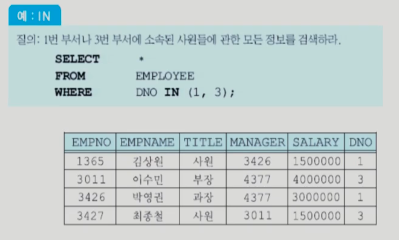

# 데이터베이스

[데이터베이스-이화여대 용환승교수](http://www.kocw.net/home/search/kemView.do?kemId=1064626&ar=relateCourse)

## 4장. 관계 대수와 SQL

- 관계 데이터 모델에서 지원되는 두 가지 정형적인 언어

  두 가지 연산 가능: 관계 해석, 관계 대수

  - 관계 해석(relational calculus)
    - 원하는 데이터만 명시하고 질의를 어떻게 수행할 것인가는 명시하지 않는 선언적인 언어
    - What에 대한 것 표현
  - 관계 대수(relational algebra)
    - 어떻게 질의를 수행할 것인가를 명시하는 절차적 언어
    - How에 대한 것 표현, 관계 해석보다 하위레벨이지만 이해하기 훨씬 쉬움
    - 관계 대수는 상용 관계 DBMS들에서 널리 사용되는 SQL의 이론적인 기초
    - 관계 대수는 SQL을 구현하고 최적화하기 위해 DBMS의 내부 언어로서도 사용됨

- SQL

  - 상용 관계 DBMS들의 사실상 표준 질의어인 SQL을 이해하고 사용할 수 있는 능력은 매우 중요함
  - 사용자는 SQL을 사용하여 관계 데이터베이스에 릴레이션을 정의하고, 관계 데이터베이스에서 정보를 검색하고, 관계 데이터베이스를 갱신하며, 여러 가지 무결성 제약조건들을 명시할 수 있음

### 4.1 관계 대수

- 관계 대수(relational algebra)
  - 기존의 릴레이션들로부터 새로운 릴레이션을 생성함
  - 릴레이션이나 관계 대수식(이것의 결과도 릴레이션임)에 연산자들을 적용하여 보다 복잡한 관계 대수식을 점차적으로 만들 수 있음
  - 기본적인 연산자들의 집합으로 이루어짐
  - 산술 연산자와 유사하게 단일 릴레이션이나 두 개의 릴레이션을 입력으로 받아 하나의 결과 릴레이션을 생성함
  - 결과 릴레이션은 또 다른 관계 연산자의 입력으로 사용될 수 있음

- 릴레이션을 인풋으로 받아서 또 다른 연산자의 인풋으로 줘서 연속적으로 연산을 해서 원하는 결과 릴레이션을 생성함

- 관계 연산자들의 종류와 표기법

  - 
    - 필수적인 연산자: CPU가 바로 처리할 수 있는 명령
    - 편의를 위해 유도된 연산자: 필수연산자를 이용해서 정의할 수 있는 연산자 (like function def)

- 관계 연산자들의 기능

  - 

  - 파티션과 디비전 같은 것을 어떻게 빨리할 것인가?

- 셀렉션 연산자

  - 한 릴레이션에서 셀렉션 조건(selection condition)을 만족하는 튜플들의 부분 집합을 생성함
  - 단항 연산자
  - 결과 릴레이션의 차수는 입력 릴레이션의 차수와 같음
  - 결과 릴레이션의 카디날리티는 항상 원래 릴레이션의 카디날리티보다 작거나 같음
  - 셀렉션 조건을 프레디키트(predicate, 술어 또는 술어식)라고도 함
  - 셀렉션 조건(True/False)은 일반적으로 릴레이션의 임의의 애트리뷰트와 상수, =, <>, <=, <, >=, > 등의 비교 연산자, AND, OR, NOT 등의 부울 연산자를 포함할 수 있음
  - 
    - 셀렉션은 하나에 대한 연산만 가능
  - 이 관계대수 연산식은 DBMS가 표현

- 프로젝션 연산자

  - 한 릴레이션의 애트리뷰트들의 부분 집합을 구함
  - 결과로 생성되는 릴레이션은 <애트리뷰트 리스트>에 명시된 애트리뷰트들만 가짐
  - **셀렉션의 결과 릴레이션에는 중복 튜플이 존재할 수 없지만, 프로젝션 연산의 결과 릴레이션에는 중복된 튜플들이 존재할 수 있음**
  - 

  - 
    - 중복된 값을 존재/제거 -> 직급 검색에선 중복된 것은 의미가 없음
    - 집합은 중복을 허용하지 않음 (중복 허용 집합: bag)
    - 중복을 제거하는 것은 sorting연산보다 오래 걸림. 튜플에서 중복여부를 체크하는 것이기 때문에 시간이 오래걸리는 연산이므로, 프로젝션을 수행할 때 중복을 제거하지 않기로 타협. 사용자가 특별히 명령하지 않는 이상 중복 허용. 셀렉션은 중복 x

- 집합 연산자

  - 릴레이션이 튜플들의 집합이기 때문에 기존의 집합 연산이 릴레이션에 적용됨
  - 세 가지 집합 연산자: 합집합, 교집합, 차집합 연산자
  - 집합 연산자의 입력으로 사용되는 두개의 릴레이션은 <u>합집합 호환(union compatible)이어야 함</u> (합집합 연산을 수행할 수 있는 연산. 애트리뷰트의 수가 같아야하고, 두 릴레이션의 같은 위치의 도메인이 같아야 함.)
  - 이항 연산자

- 합집합 호환

  - 두 릴레이션 R1(A1, A2, ,.. An)과 R2(B1, B2, ... ,Bm)이 합집합 호환일 필요 충분 조건은 n=m이고, 모든 1<=i<n에 대해 domain(Ai)=domain(Bi)
  - 

- 합집합 연산자

  - 두 릴레이션 R과 S의 합집합 R U S는 R 또는 S에 있거나 R과 S 모두에 속한 튜플들로 이루어진 릴레이션
  - 결과 릴레이션에서 중복된 튜플들은 <u>제외됨</u>
  - 결과 릴레이션의 차수는 R 또는 S의 차수와 같으며, 결과 릴레이션의 애트리뷰트 이름들은 R의 애트리뷰트들의 이름과 같거나 S의 애트리뷰트들의 이름과 같음
  - 
    - 관계 연산자는 얼마든지 반복해서 괄호로 묶어서 사용 가능함

  - 

- 교집합 연산자

  - 두 릴레이션 R과 S의 교집합 R ∩ S는 R과 S 모두에 속한 튜플들로 이루어진 릴레이션
  - 결과 릴레이션의 차수는 R 또는 S의 차수와 같으며, 결과 릴레이션의 애트리뷰트 이름들은 R의 애트리뷰트들의 이름과 같거나 S의 애트리뷰트들의 이름과 같음

- 차집합 연산자

  - 두 릴레이션 R과 S의 차집합 R - S는 R에는 속하지만 S에는 속하지 않은 튜플들로 이루어진 릴레이션
  - 결과 릴레이션의 차수는 R 또는 S의 차수와 같으며, 결과 릴레이션의 애트리뷰트 이름들은 R의 애트리뷰트들의 이름과 같거나 S의 애트리뷰트들의 이름과 같음

- 카디션 곱 연산자

  - 카디날리티가 i인 릴레이션 R(A1, A2, ... An)과 카디날리티가 j인 릴레이션 S(B1, B2, ..., Bm)의 카티션 곱 R x S는 차수가 <u>n+m</u>이고, 카디날리티가 i*j이고, 애트리뷰트가 (A1, A2, ..., An, B1, B2, ..., Bm)이며, R과 S의 튜플들의 모든 가능한 조합으로 이루어진(두 튜플을 접합(스트링)) 릴레이션
  - 카티션 곱의 결과 릴레이션의 크기가 매우 클 수 있으며, 사용자가 실제로 원하는 것은 카티션 곱의 결과 릴레이션의 일부인 경우가 대부분이므로 카티션 곱 자체는 유용한 연산자가 아님
  - 

  - 이론적으로 가능, 실제로 쓰지 않고 조인을 위한 연산

- 관계 대수의 완전성

  - 셀렉션, 프로젝션, 합집합, 차집합, 카티션 곱은 관계 대수의 필수적인 연산자
  - 다른 관계 연산자들은 필수적인 관계 연산자를 두 개 이상 조합하여 표현할 수 있음
  - 임의의 질의어가 적어도 필수적인 관계 대수 연산자들만큼의 <u>표현력</u>을 갖고 있으면 관계적으로 완전(relationally comlete)하다고 말함

- 조인 연산자

  - 두 개의 릴레이션으로부터 연관된 튜플들을 결합하는 연산자
  - 관계 데이터베이스에서 두 개 이상의 릴레이션들의 관계를 다루는데 매우 중요한 연산자
  - 세타 조인(theta join), 동등 조인(equijoin), 자연 조인(natural join), 외부 조인(outer join), 세미 조인(semijoin) 등

- 세타 조인과 동등 조인

  - 두 릴레이션 R(A1, A2, ...An)과 S(B1, B2, ..., Bm)의 세타 조인의 결과는 차수가 n+m이고, 애트리뷰트가 (A1, A2, ..., An, B1, B2, ..., Bm)이며, 조인 조건을 만족하는 튜플들로 이루어진 릴레이션
  - 세타는 {=, <>, <=, <, >=, >} 중의 하나
  - 동등 조인은 세타 조인 중에서 비교 연산자가 =인 조인

  - 
    - 같은 조건만 묶고 나머지는 제외함

- 자연 조인

  - 동등 조인의 결과 릴레이션에서 조인 애트리뷰트
  - 여러 가지 조인 연산자들 중에서 <u>가장 자주 사용됨</u>
  - 실제로 관계 데이터베이스에서 대부분의 질의는 셀렉션, 프로젝션, 자연 조인으로 표현 가능
  - 

  - 튜플 수가 많은 경우 조인의 결과는 굉장히 큼

- 디비전 연산자

  - 차수가 n+m인 릴레이션 R(A1, A2, ...An, B1, B2, ..., Bm)과 차수가 m인 릴레이션 S(B1, B2, ..., Bm)의 디비전 R / S는 차수가 n이고, S에 속하는 모든 튜플 u에 대하여 튜플 tu(튜플 t와 튜플 u을 결합한 것)과 R에 존재하는 튜플 t들의 집합

  - 나눠지는 릴레이션을 모두 포함해야 함

    

- 관계 대수 질의의 예

  

  - 프로젝션 한 후 셀렉션을 할 수 없음 (DNO 수행)

- 관계 대수의 한계

  - 관계 대수는 산술 연산을 할 수 없음
  - 집단 함수(aggregate function)을 지원하지 않음
  - 정렬을 나타낼 수 없음
  - 데이터베이스를 수정할 수 없음 (업데이트 연산 없음)
  - 프로젝션 연산의 결과에 중복된 튜플을 나타내는 것이 필요할 때가 있는데 이를 명시하지 못함

- 추가된 관계 대수 연산자

  - 집단 함수 (모든 평균)

    

  - 그룹화 (부서별 평균 group by 연산)

    

## 4.2 SQL 개요

- SQL 개요

  - SQL은 현재 DBMS 시장에서 관계 DBMS가 압도적인 우위를 차지하는데 중요한 요인의 하나

  - SQL은 IBM 연구소에서 1974년에 System R이라는 관계 DBMS 시제품을 연구할 때 관계 대수와 관계 해석을 기반으로, 집단 함수, 그룹화, 갱신 연산 등을 추가하여 개발된 언어

  - 1986년에 ANSI(미국 표준 기구)에서 SQL 표준을 채택함으로써 SQL이 널리 사용되는데 기여

  - 다양한 상용 관계 DBMS마다 지원하는 SQL 기능에 다소 차이가 있음

  - 본 책에서는 SQL2를 따름

  - 

  - SQL은 비절차적 언어(선언적 언어)이므로 사용자는 자신이 원하는 바(what)만 명시하며, 원하는 것을 처리하는 방법(how)은 명시할 수 없음

  - 관계 DBMS는 사용자가 입력한 SQL문을 번역하여 사용자가 요구한 데이터를 찾는데 필요한 모든 과정을 담당

  - 자연어에 가까운 구문을 사용하여 질의를 표현할 수 있음

  - 두 가지 인터페이스

    - 대화식 SQL(interactive SQL)
    - 내포된 SQL(embedded SQL)

    

    

---

## 4.3 데이터 정의어와 무결성 제약 조건

- 데이터 정의어

  - 스키마의 생성과 제거

    - SQL2에서는 동일한 데이터베이스 응용에 속하는 릴레이션, 도메인, 제약조건, 뷰, 권한 등을 그룹화하기 위해서 스키마 개념을 지원

      - CREATE SCHEMA MY_DB AUTHORIZATION kim;

        DROP SCHEMA MY_DB RESTRICT;

        DROP SCHEMA MY_DB CASCADE;

- 릴레이션 정의

  - CREATE TABLE DEPARTMENT

    ​			(DEPTNO		INTEGER NOT NULL,

    ​			DEPTNAME 	CHAR (10),

    ​			FLOOR 			INTEGER,

    ​			PRIMARY KEY (DEPTNO));

    CREATE TABLE EMPROYEE

    ​			(EMPNO			INTEGER NOT NULL,

    ​			EMPNAME		CHAR (10),

    ​			TITLE				  CHAR (10),

    ​			MANAGER 		INTEGER,

    ​			SALARY			  INTEGER,

    ​			DNO				   INTEGER,

    ​			PRIMARY KEY (EMPNO),

    ​			FOREIGN KEY (MANAGER) REFERENCES EMPROYEE (EMPNO),

    ​			FOREIGN KEY (DNO) REFERENCES DEPARTMENT (DEPTNO));

  - 

- 릴레이션 제거

  DROP TABLE DEPARTMENT;

- ALTER TABLE

  ALTER TABLE EMPLOYEE ADD PHONE CHAR (13);

- 인덱스 생성

  CREATE INDEX EMPDNO_IDX ON EMPLOYEE(DNO);

- 도메인 생성

  CREATE DOMAIN DEPTNAME CHAR(10) DEFAULT '개발';

- 제약조건

  

- 참조 무결성 제약조건 유지

  ON DELETE NO ACTION

  ON DELETE CASCADE

  ON DELETE SET NULL

  ON DELETE SET DEFAULT

  

  ON UPDATE NO ACTION

  ON UPDATE CASCADE

  ON UPDATE SET NULL

  ON UPDATE SET DEFAULT

- 무결성 제약조건의 추가 및 삭제

  ALTER TABLE STUDENT ADD CONSTRAINT STUDENT_PK

  ​		PRIMARY KEY (STNO);

  ALTER TABLE STUDENT DROP CONSTRAINT STUDENT_PK;

## 4.4 SELECT 문

- SELECT문

  - 관계 데이터베이스에서 정보를 검색하는 SQL문
  - 관계 대수의 실렉션과 의미가 완전 다름
  - 관계 대수의 실렉션, 프로젝션, 조인, 카티션 곱 등을 결합한 것
  - 관계 데이터베이스에서 가장 자주 사용됨
  - 여러 가지 질의들의 결과를 보이기 위해서 그림 4.8의 관계 데이터베이스 상태를 사용함

- 기본적인 SQL 질의

  - SELECT절과 FROM절만 필수적인 절이고, 나머지는 선택 사항
  - 

- 별칭(alias)

  - 서로 다른 릴레이션에 동일한 이름을 가진 애트리뷰트가 속해 있을 때 애트리뷰트의 이름을 구분하는 방법

    EMPLOYEE.DNO

    FROM EMPLOYEE AS E, DEPARTMENT AS D

- 상이한 값들을 검색

  

- 다수의 검색 조건

  - 아래와 같은 질의는 잘못되었음

    

- 범위를 사용한 검색

  

- 리스트를 사용한 검색

  

- SELECT절에서 산술 연산자(+,-,*,/) 사용

  

- 널값

  - 널값을 포함한 다른 값과 널값을 +, - 등을 사용하여 연산하면 결과는 널

  - COUNT(*)를 제외한 집단 함수들은 널값을 무시함

  - 어떤 애트리뷰트에 들어 있는 값이 널인가 비교하기 위해서

    'DNO=NULL' 처럼 나타내면 안됨

    ​	SELECT	  EMPNO, EMPNAME

    ​	FROM		EMPLOYEE

    ​	WHERE	  DNO = NULL;

  - 다음과 같은 비교 결과는 모두 거짓

    NULL > 300

    NULL = 300

    NULL <> 300

    NULL = NULL

    NULL <> NULL

  - 올바른 표현

    SELECT	EMPNO, EMPNAME

    FROM	  EMPLOYEE

    WHERE	DNO IS NULL;

    

- 집단 함수

  - 데이터베이스에서 검색된 여러 튜플들의 집단에 적용되는 함수

  - 한 릴레이션의 한 개의 애트리뷰트에 적용되어 단일 값을 반환함

  - SELECT절과 HAVING절에만 나타날 수 있음

  - COUNT(*)를 제외하고는 널값을 제거한 후 남아 있는 값들에 대해서 집단 함수의 값을 구함

  - COUNT(*)는 결과 릴레이션의 모든 행들의 총 개수를 구하는 반면에 COUNT(애트리뷰트)는 해당 애트리뷰트에서 널값이 아닌 값들의 개수를 구함

  - 키워드 DISTINCT가 집단 함수 앞에 사용되면 집단 함수가 적용되기 전에 먼저 중복을 제거함

    

- 그룹화

  - GROUP BY절에 사용된 애트리뷰트에 동일한 값을 갖는 튜플들이 각각 하나의 그룹으로 묶임

  - 이 애트리뷰트를 그룹화 애트리뷰트(grouping attribute)라고 함

  - 각 그룹에 대하여 결과 릴레이션에 하나의 튜플이 생성됨

  - SELECT절에는 각 그룹마다 하나의 값을 갖는 애트리뷰트, 집단 함수, 그룹화에 사용된 애트리뷰트들만 나타날 수 있음

  - 다음 질의는 그룹화를 하지 않은 채 EMPLOYEE 릴레이션의 모든 튜플에 대해서 사원번호와 모든 사원들의 평균 급여를 검색하므로 잘못됨

    SELECT  EMPNO, AVG(SALARY)

    FROM 	EMPLOYEE;

    

- 집합 연산

  - 집합 연산을 적용하려면 두 릴레이션이 합집합 호환성을 가져야 함

- 조인

  - 조인은 두 개 이상의 릴레이션으로부터 연관된 튜플들을 결합
  - 조인의 일반적인 형식은 아래의 SELECT문과 같이 FROM절에 두 개 이상의 릴레이션들이 열거되고, 두 릴레이션에 속하는 애트리뷰트들을 비교하는 조인 조건이 WHERE절에 포함됨
  - 조인 조건은 두 릴레이션 사이에 속하는 애트리뷰트 값들을 비교 연산자로 연결한 것
  - 가장 흔히 사용되는 비교 연산자는 =

- 자체 조인(self join)

  - 한 릴레이션에 속하는 튜플을 동일한 릴레이션에 속하는 튜플들과 조인하는 것
  - 실제로는 한 릴레이션이 접근되지만 FROM절에 두 릴레이션이 참조되는 것처럼 나타내기 위해서 그 릴레이션에 대한 별칭을 두 개 지정해야 함

- 중첩 질의(nested query)

  - 외부 질의의 WHERE절에 다시 SELECT ... FROM ... WHERE 형태로 포함된 SELECT문
  - 부질의(subquery)라고 함
  - INSERT, DELETE, UPDATE문에도 사용될 수 있음
  - 중첩 질의의 결과로 한 개의 스칼라값(단일 값), 한 개의 애트리뷰트로 이루어진 릴레이션, 여러 애트리뷰트로 이루어진 릴레이션이 반환될 수 있음

- 한 개의 스칼라 값이 반환되는 경우

- 한 개의 애트리뷰트로 이루어진 릴레이션이 반환되는 경우

  - 중첩 질의의 결과로 한 개의 애트리뷰트로 이루어진 다수의 튜플들이 반환될 수 있음
  - 외부 질의의 WHERE절에서 IN, ANY(SOME), ALL, EXISTS와 같은 연산자를 사용해야 함
  - 키워드 IN은 한 애트리뷰트가 값들의 집합에 속하는가를 테스트할 때 사용됨
  - 한 애트리뷰트가 값들의 집합에 속하는 하나 이상의 값들과 어떤 관계를 갖는가를 테스트하는 경우에는 ANY를 사용
  - 한 애트리뷰트가 값들의 집합에 속하는 모든 값들과 어떤 관계를 갖는가를 테스트하는 경우에는 ALL을 사용

- 여러 애트리뷰트들로 이루어진 릴레이션이 반환되는 경우

  - 중첩 질의의 결과로 여러 애트리뷰트들로 이루어진 릴레이션이 반환되는 경우에는 EXISTS 연산자를 사용하여 중첩 질의의 결과가 빈 릴레이션인지 여부를 검사함
  - 중첩 질의의 결과가 빈 릴레이션이 아니면 참이 되고, 그렇지 않으면 거짓

- 상관 중첩 질의(correlated nested query)

  - 중첩 질의의 WHERE절에 있는 프레디키트에서 외부 질의에 선언된 릴레이션의 일부 애트리뷰트를 참조하는 질의
  - 중첩 질의의 수행 결과가 단일 값이든, 하나 이상의 애트리뷰트로 이루어진 릴레이션이든 외부 질의로 한 번만 결과를 반환하면 상관 중첩 질의가 아님
  - 상관 중첩 질의에서는 외부 질의를 만족하는 각 튜플이 구해진 후에 중첩질의가 수행되므로 상관 중첩 질의는 외부 질의를 만족하는 튜플 수만큼 여러 번 수행될 수 있음

- INSERT문

  - 릴레이션에 한 번에 여러 개의 튜플들을 산ㅂ입하는 INSERT문

- DELETE문

  - 삭제 연산은 한 릴레이션으로부터 한 개 이상의 튜플들을 삭제함

  - 참조되는 릴레이션의 삭제 연산의 결과로 참조 무결성 제약조건이 위배될 수 있으나, 참조하는 릴레이션에서 튜플을 삭제하면 참조 무결성 제약조건을 위배하지 않음

  - DELETE문의 구문

    DELETE

    FROM	  릴레이션

    WHERE	조건;

- UPDATE문

  - 한 릴레이션에 들어 있는 튜플들의 애트리뷰트 값들을 수정

  - 기본 키나 외래 키에 속하는 애트리뷰트의 값이 수정되면 참조 무결성 제약조건을 위배할 수 있음

  - UPDATE문의 구문

    UPDATE	 릴레이션

    SET			 애트리뷰트 = 값 또는 식

    WHERE		조건;

---

## 4.6 트리거와 주장

- 트리거

  - 명시된 이벤트(데이터베이스의 갱신)가 발생할 때마다 DBMS가 자동적으로 수행하는 사용자가 정의하는 문(프로시저)
  - 데이터베이스의 무결성을 유지하기 위한 일반적이고 강력한 도구
  - 테이블 정의시 표현할 수 없는 기업의 비즈니스 규칙들을 시행하는 역할
  - 트리거를 명시하려면 트리거를 활성화시키는 사건인 이벤트, 트리거가 활성화되었을 때 수행되는 테스트인 조건, 트리거가 활성화되고 조건이 참일 때 수행되는 문(프로시저)인 동작을 표현해야 함
  - 트리거는 이벤트-조건-동작(ECA) 규칙이라고도 부름
  - SQL3 표준에 포함되었으며 대부분의 상용 관계 DBMS에서 제공됨

- 연쇄적으로 활성화되는 트리거

  - 하나의 트리거가 활성화되어 이 트리거 내의 한 SQL문이 수행되고, 그 결과로 다른 트리거를 활성화하여 그 트리거 내의 SQL문이 수행될 수 있음

- 주장

  - 주장은 SQL3에 포함되어 있으나 대부분 상용 관계 DBMS가 아직 지원하고 있지 않음

  - 트리거는 제약조건을 위반했을 때 수행할 동작을 명시하는 것이고, 주장은 제약조건을 위반하는 연산이 수행되지 않도록 함

  - 주장의 구문

    CREATE ASSERTION 이름

    CHECK 조건;

  - 트리거보다 좀 더 일반적인 무결성 제약조건

  - DBMS는 주장의 프레디키트를 검사하여 만일 참이면 주장을 위배하지 않는 경우이므로 데이터베이스 수정이 허용됨

  - 일반적으로 두 개 이상의 테이블에 영향을 미치는 제약조건을 명시하기 위해 사용됨

---

## 4.7 내포된 SQL

- 내포된 SQL(embedded SQL)
  - SQL이 호스트 언어의 완전한 표현력을 갖고 있지 않기 때문에 모든 질의를 SQL로 포현할 수 는 없음
  - SQL은 호스트 언어가 갖고 있는 조건문, 반복문, 입출력 등과 같은 동작, 사용자와의 상호 작용, 질의 결과를 GUI로 보내는 등의 기능을 갖고 있지 않음
  - 호스트 언어에 포함되는 SQL문을 내포된 SQL이라 부름
  - 데이터 구조가 불일치하는 문제(impedance mismatch) 

- ESQL/C
  - 정적인 SQL문과 동적인 SQL문 모두 지원
  - 정적인 SQL문은 C 프로그램에 내포된 완전한 Transact-SQL문
  - 동적인 SQL문은 불완전한 Transact-SQL문으로서 일부 또는 전부를 질의가 수행될 때 입력 가능
  - 정적인 SQL문은 입력값과 출력 데이터를 위해서 C 프로그램의 변수들을 포함할 수 있음
  - SQL문에 포함된 C 프로그램의 변수를 호스트 변수(host variable)라고 부름

## 4.7 내포된 SQL

- 불일치 문제와 커서
  - 호스트 언어는 단일 변수/레코드 위주의 처리(튜플 위주의 방식)를 지원하는 반면에 SQL은 데이터 레코드들의 처리(집합 위주의 방식)를 지원하기 때문에 불일치 문제가 발생함
  - 불일치 문제를 해결하기 위해서 커서(cursor)가 사용됨
  - 커서는 한 번에 한 튜플씩 가져오는 수단
  - DECLARE CURSOR문을 사용하여 커서를 정의함
  - OPEN cursor문은 질의를 수행하고, 질의 수행 결과의 첫 번째 튜플 이전을 커서가가리키도록 함 이 것이 현재 튜플
  - 그 다음에 FETCH문은 커서를 다음 튜플로 이동하고, 그 튜플의 애트리뷰트 값들을 FETCH문에 명시된 호스트 변수들에 복사함
  - CLOSE cursor 커서 닫음
- SQL 통신 영역(SQLCA)
  - C 프로그램에 내포된 SQL문에 발생하는 에러들을 사용자에게 알려줌
  - 사용자는 SQLCA 데이터 구조의 에러 필드와 상태 표시자를 검사하여 내포된 SQL문이 성공적으로 수행되었는가 또는 비정상적으로 수행되었는가를 파악할 수 있음
  - SQLCA 데이터 구조 중에서 가장 중요하고 널리 사용되는 필드는 SQLCODE 변수

# 5장. 데이터베이스 설계와 ER 모델

- 데이터베이스 셜계
  - 개념적 데이터베이스 설계는 실제로 데이터베이스를 어떻게 구현할 것인가와는 독립적으로 정보 사용의 모델을 개발하는 과정
  - 물리적 데이터베이스 셜계에서는 물리적인 저장 장치와 접근 방식을 다룸
  - 개념적 데이터베이스 셜계 과정에서 조직체(실세계)의 엔티티 ,관계, 프로세스, 무결성 제약조건 등을 나타내는 추상화 모델을 구축
- 개념적 수준의 모델
  - 특정 데이터 모델과 독립적으로 응용 세계를 모델링할 수 있도록 함
  - 데이터 베이스 구조나 스키마를 하향식으로 개발할 수 있기 위한 틀을 제공
  - 인기 있는 개념적 수준의 모델은 엔티티-관계(ER) 모델

## 5.1 데이터베이스 설계의 개요

- 데이터베이스 설계의 개요
  - 한 조직체의 운영과 목적을 지원하기 위해 데이터베이스를 생성하는 과정
  - 목적은 모든 주요 응용과 사용자들이 요구하는 데이터, 데이터 간의 관계를 표현하는 것
  - 데이터베이스 개발은 일반적인 프로젝트 라이프 사이클 과정을 따름
  - 훌륭한 데이터베이스 셜계는 시간의 흐름에 따른 데이터의 모든 측면을 나타내고, 데이터 항목을 중복을 최소화, 데이터베이스에 대한 효율적 접근 제공, 데이터베이스의 무결성 제공, 이해하기 쉬워야함
- 요구사항 수집과 분석
  - 흔히 기존의 문서를 조사, 인터뷰, 설문 조사 등
  - 요구사항에 관한 지식을 기반으로 관련 있는 엔티티들과 이들의 애트리뷰트들이 무엇인가, 엔티티들 간의 관계가 무엇인가 등을 파악
  - 또한 데이터 처리에 관한 요구사항에 대해 전형적인 연산들은 무엇인가, 연산들의 의미, 접근하는 데이터의 양 등을 분석

- DBMS 선정
  - 여러 가지 요인들을 검토한 후 DBMS를 선정함
  - 기술적인 요인을 DBMS가 제공하는 데이터 모델, 저장 구조, 인터페이스, 질의어, 도구, 제공되는 서비스 등
- 물리적 설계
  - 처리 요구사항들을 만족시키기 위해 저장 구조와 접근 경로 등을 결정함

- 트랜잭션 설계
  - 요구 사항 수집과 분석 후에 데이터베이스 설계 과정과 별도로 트랜잭션 설계를 진행할 수 있음

## 5.2 ER 모델

- ER 모델

  - 데이터베이스 설계를 용이하게 하기 위해서 P.P Chen이 1976년에 제안하였음
  - 현재는 EER 모델이 데이터베이스 설계 과정에 널리 사용되고 있음
  - 개념적인 설계를 위한 인기 있는 모델로서, 높은 수준으로 추상화하며, 이해하기 쉬우며, 구문들의 표현력이 뛰어나고 사람들의 응용에 대해 생각하는 방식과 가깝고, 많은 CASE 도구들에서 지원됨

  - 현재는 데이터베이스 설계를 위한 다소 구형 그래픽 표기법

- 엔티티 타입
  - 엔티티들은 엔티티 타입(또는 엔티티 집합)들로 분류됨
  - 엔티티 타입은 동일한 애트리뷰트들을 가진 엔티티들의 틀
  - 엔티티 집합은 동일한 애트리뷰트들을 가진 엔티티들의 모임
  - 하나의 엔티티는 한 개 이상의 엔티티 집합에 속할 수 있음
  - 엔티티 타입은 관계 모델의 릴레이션의 내포에 해당하고, 엔티티 집합은 관계 모델의 릴레이션의 외연에 해당
  - 엔티티 집합과 엔티티 타입을 엄격하게 구분할 필요 없음
  - ER 다이어그램에서 엔티티 타입은 직사각형으로 나타냄

- 강한 엔티티 타입
  - 강한 엔티티 타입(정규 엔티티 타입)은 독자적으로 존재하며 엔티티 타입 내에서 자신의 키 애트리뷰트를 사용하여 고유하게 엔티티들을 식별할 수 있는 엔티티 타입
- 약한 엔티티 타입
  - 약한 엔티티 타입은 키를 형성하기에 충분한 애트리뷰트들을 갖지 못한 엔티티 타입
  - 이 엔티티 타입이 존재하려면 소유 엔티티 타입이 있어야 함
  - 소유 엔티티 타입의 키 애트리뷰트를 결합해야만 고유하게 약한 엔티티 타입의 엔티티들을 식별할 수 있음
- 애트리뷰트
  - 하나의 엔티티는 연관된 애트리뷰트들의 집합으로 설명됨
  - 한 애트리뷰트의 도메인은 그 애트리뷰트가 가질 수 있는 모든 가능한 값들의 집합을 의미
  - 여러 애트리뷰트가 동일한 도메인 공유 가능
  - 키 애트리뷰트는 한 애트리뷰트 또는 애트리뷰트들의 모임으로서 한 엔티티 타입 내에서 각 엔티티를 고유하게 식별
  - ER 다이어그램에서 기본 키에 속하는 애트리뷰트는 밑줄을 그어 표시

- 단순 애트리뷰트
  - 더 이상 애트리뷰트로 나눌 수 없는 애트리뷰트
  - ER 다이어그램에서 실선 타원으로 표현
  - ER 다이어그램에서 대부분 애트리뷰트는 단순 애트리뷰트
- 복합 애트리뷰트
  - 두 개 이상의 애트리뷰트로 이루어진 애트리뷰트
  - 동일한 엔티티타입이나 관계 타입에 속하는 애트리뷰트들 중에서 밀접하게 연관된 것을 모아놓은 것
- 단일값 애트리뷰트
  - 각 엔터티마다 정확하게 하나의 값을 갖는 애트리뷰트
  - ER 다이어그램에서 단순 애트리뷰트와 동일하게 표현
- 다치 애트리뷰트
  - 각 엔터티마다 여러 개의 값을 가질 수 있는 애트리뷰트
  - ER 다이어그램에서 이중선 타원으로 표현
- 저장된 애트리뷰트
  - 다른 애트리뷰트와 독립적으로 존재하는 애트리뷰트

- 유도된 애트리뷰트
  - 다른 애트리뷰트의 값으로 얻어진 애트리뷰트
  - 관계 데이터베이스에서 릴레이션의 애트리뷰트로 포함시키지 않는 것이 좋음
  - 점선 타원으로 표현
- 약한 엔티티 타입
  - 키를 형성하기에 충분한 애트리뷰트들을 갖지 못한 엔티티 타입
  - 약한 엔티티 타입에게 키 애트리뷰트를 제공하는 엔티티 타입을 소유 엔티티 타입 또는 식별 엔티티 타입이라고 부름
  - 이중선 직사각형으로 표기
  - 부분 키 : 부양 가족의 이름처럼 한 사원에 속한 부양가족 내에서는 서로 다르지만 회사 전체 사원들의 부양가족들 전체에서는 같은 경우가 생길 수 있는 애트리뷰트

- 카디날리티
  - 카디날리티 비율은 한 엔티티가 참여할 수 있는 관계의 수를 나타냄
  - 관계 타입에 참여하는 엔티티들의 가능한 조합을 제한
  - 간선 위에 나타냄

- 역할 (role)
  - 관계 타입의 의미를 명확하게 하기 위해 사용됨
  - 특히 하나의 관계 타입에 하나의 엔티티 타입이 여러 번 나타나는 경우에는 반드시 역할을 표기해야 함
  - 관계 타입의 간선 위에 표시

- 전체 참여와 부분 참여
  - 전체 참여는 어떤 관계에 엔티티 타입 E1의 모든 엔티티들이 관계 타입 R에 의해 어떤 엔티티 타입 E2의 어떤 엔티티와 연관되는 것을 의미
  - 부분 참여는 어떤 관계에 엔티티 타입 E1의 일부 엔티티만 참여하는 것을 의미

- 새발 표기법의 요약

  

## 5.2 복잡한 ER 다이어그램의 예

- ER 모델의 또 다른 표기법
  - 본 장에서 사용한 표기법으로 수십 개 이상의 애트리뷰트가 엔티티 타입에 연결된 다이어그램을 나타내려면 매우 불편하고 공간을 많이 차지
  - ERWin 등의 CASE 도구들에서는 새발(crow-feet)표기법이 흔히 사용됨
- ER 스키마를 관계 모델의 릴레이션으로 사상
  - 논리적 설계 단계에서는 ER 스키마를 관계 데이터 모델의 릴레이션들로 사상
  - ER 스키마에는 엔티티 타입과 관계 타입이 존재하지만 관계 데이터베이스에는 엔티티 타입과 관계 타입을 구분하지 않고 릴레이션만 있음

## 5.4 ER 스키마를 관계 모델의 릴레이션으로 사상

- ER-관계 사상 알고리즘

  단계 1: 정규 엔티티 타입과 단일 값 애트리뷰트

  - ER 스키마의 각 정규 엔티티 타입 E에 대해 하나의 릴레이션 R 생성
  - E에 있던 단순 애트리뷰트들을 릴레이션 R에 모두 포함시킴
  - E에서 복합 애트리뷰트는 그 복합 애트리뷰트를 구성하는 단순 애트리뷰트들만 릴레이션 R에 포함시킴
  - E의 기본 키가 릴레이션 R의 기본 키가 됨

  단계 2: 약한 엔티티 타입과 단일 값 애트리뷰트

  - ER 스키마에서 소유 엔티티 타입 E를 갖는 각 약한 엔티티 타입 W에 대해 릴레이션 R을 생성함
  - W에 있던 모든 단순 애트리뷰트들을 릴레이션 R에 포함시킴
  - 소유 엔티티 타입에 해당하는 릴레이션의 기본 키를 약한 엔티티 타입에 해당하는 릴레이션에 외래 키로 포함시킴

  단계 3: 2진 1:1 관계 타입

  - ER 스키마의 각 2진 1:1 관계 타입 R에 대해, R에 참여하는 엔티티 타입에 대응되는 릴레이션 S와 T를 찾음
  - S와 T 중 한 릴레이션을 선택하여 만일 S를 선택했다면 T의 기본 키를 S에 외래 키로 포함 시킴
  - S와 T 중에서 관계 타입에 완전하게 참여하는 릴레이션을 S 역할을 하는 릴레이션으로 선택

  단계 4: 정규 2진 1:N 관계 타입

  - 정규 2진 1:N 관계 타입 R에 대해 N측의 참여 엔티티 타입에 대응되는 릴레이션 S를 찾음
  - 관계 타입 R에 참여하는 1측의 엔티티 타입에 대응되는 릴레이션 T의 기본키를 릴레이션 S에 외래키로 포함시킴
  - N측의 릴레이션 S의 기본 키를 1측의 릴레이션 T에 외래키로 포함시키면 애트리뷰트에 값들의 집합이 들어가거나 정보의 중복이 많이 발생함

  단계 5: 2진 M:N 관계 타입

  - 2진 M:N 관계 타입 R에 대해서는 릴레이션 R을 생성
  - 참여 엔티티 타입에 해당하는 릴레이션들의 기본 키를 릴레이션 R에 외래 키로 포함시키고, 이들의 조합이 릴레이션 R의 기본 키가 됨

  단계 6: 3진 이상의 관계 타입

  - 3진 이상의 각 관계 타입 R에 대해 릴레이션 R을 생성
  - 관계 타입 R에 참여하는 모든 엔티티 타입에 대응되는 릴레이션들의 기본키를 릴레이션 R에 외래키로 포함시킴
  - 일반적으로 외래 키들의 조합이 릴레이션 R의 기본키가 됨

  단계 7: 다치 애트리뷰트

  - 각 다치 애트리뷰트에 대해 릴레이션 R 생성
  - 다치 애트리뷰트에 해당하는 애트리뷰트를 릴레이션 R에 포함시키고 다치애트리뷰트를 애트리뷰트로 갖는 엔티티 타입이나 관계 타입에 해당하는 릴레이션의 기본 키를 릴레이션 R에 외래 키로 포함시킴
  - 릴레이션 R의 기본 키는 다치 애트리뷰트와 외래키의 조합

---

## 6장. 물리적 데이터베이스 설계

- 물리적 데이터베이스 설계
  - 논리적인 설계의 데이터 구조를 보조 기억 장치상의 화일(물리적인 데이터 모델)로 사상함
  - 예상 빈도를 포함하여 데이터베이스 질의와 트랜잭션들을 분석함
  - 데이터에 대한 효율적인 접근을 제공하기 위하여 저장 구조와 접근 방법들을 다룸
  - 특정 DBMS의 특성을 고려하여 진행됨
  - 질의를 효율적으로 지원하기 위해서 인덱스 구조를 적절히 사용함

### 6.1 보조 기억 장치

- 보조 기억 장치
  - 사용자가 원하는 데이터를 검색하기 위해서 DBMS는 디스크 상의 데이터베이스로부터 사용자가 원하는 데이터를 포함하고 있는 블록을 읽어서 주기억 장치로 가져옴
  - 데이터가 변경된 경우에는 블록들을 디스크에 다시 기록함
  - 블록 크기는 512바이트부터 수 킬로바이트까지 다양함
  - 전형적인 블록 크기는 4,096바이트
  - 각 화일은 고정된 크기의 블록들로 나누어져서 저장됨
  - 디스크는 데이터베이스를 장기간 보관하는 주된 보조 기억 장치
- 자기 디스크
  - 디스크는 자기 물질로 만들어진 여러 개의 판으로 이루어짐
  - 각 면마다 디스크 헤드가 있음
  - 각 판은 트랙과 섹터로 구분됨
  - 정보는 디스크 표면 상의 동심원(트랙)을 따라 저장됨
  - 여러 개의 디스크 면 중에서 같은 지름을 갖는 트랙들을 실린더라고 부름
  - 블록은 한 개 이상의 섹터들로 이루어짐
  - 디스크에서 임의의 블록을 읽어오거나 기록하는데 걸리는 시간은 탐구시간(seek time), 회전 지연 시간(rotational delay), 전송 시간(transfer time)의 합

### 6.2 버퍼 관리와 운영 체제

- 버퍼 관리와 운영 체제

  - 디스크 입출력은 컴퓨터 시스템에서 가장 속도가 느린 작업이므로 입출력 횟수를 줄이는 것이 DBMS의 성능을 향상하는데 매우 중요
  - 가능하면 많은 블록들을 주기억 장치에 유지하거나, 자주 참조되는 블록들을 주기억 장치에 유지하면 블록 전송 횟수를 줄일 수 있음
  - 버퍼는 디스크 블록들을 저장하는데 사용되는 주기억 장치 공간
  - 버퍼 관리자는 운영 체제의 구성요소로서 주기억 장치 내에서 버퍼 공간을 할당하고 관리하는 일을 맡음
  - 운영 체제에서 버퍼 관리를 위해 흔히 사용되는 LRU 알고리즘은 데이터베이스를 위해 항상 우수한 성능을 보이지는 않음

  

### 6.3 디스크 상에서 화일의 레코드 배치

- 디스크 상에서 화일의 레코드 배치

  - 릴레이션의 애트리뷰트는 고정 길이 또는 가변 길이의 필드로 표현됨
  - 연관된 필드들이 모여서 고정 길이 또는 가변 길이의 레코드가 됨
  - 한 릴레이션을 구성하는 레코드들의 모임이 화일이라고 부르는 블록들의 모임에 저장됨

  

  - 한 화일에 속하는 블록들이 반드시 인접해 있을 필요는 없음

  - 인접한 블록들을 읽는 경우에는 탐구 시간과 회전 지연 시간이 들지 않기 때문에 입출력 속도가 빠르므로 블록들이 인접하도록 한 화일의 블록들을 재조직할 수 있음

    

- BLOB(Binary Large Object)

  - 이미지(GIF, JPG), 동영상(MPEG, AVI) 등 대규모 크기의 데이터를 저장하는데 사용됨
  - BLOB의 최대 크기는 MS SQL Server에서 2GB까지도 가능

- 채우기 인수

  - 각 블록에 레코드를 채우는 공간의 비율

  - 나중에 레코드가 삽입될 때 기존의 레코드들을 이동하는 가능성을 줄이기 위해서

    

- 고정 길이 레코드

  - 레코드 i를 접근하기 위해서는 n*(i-1)+1의 위치에서 레코드를 읽음

  

  

- 화일 내의 클러스터링(intra-file clustering)

  - 한 화일 내에서 함께 검색될 가능성이 높은 레코드들을 디스크 상에서 물리적으로 가까운 곳에 모아두는 것

    

### 6.4 화일 조직

- 화일 조직의 유형

  - 히프 화일(heap file)
  - 순차 화일(sequential file)
  - 인덱스된 순차 화일(indexed sequential file)
  - 직접 화일(hash file)

- 히프 파일(비순서 화일)

  - 가장 단순한 화일 조직
  - 일반적으로 레코드들이 삽입된 순서대로 화일에 저장됨
  - 삽입: 새로 삽입되는 레코드는 화일의 가장 끝에 첨부됨
  - 검색: 원하는 레코드를 찾기 위해서는 모든 레코드들을 순차적으로 접근해야 함
  - 삭제: 원하는 레코드를 찾은 후에 그 레코드를 삭제하고, 삭제된 레코드가 차지하던 공간을 재사용하지 않음
  - 좋은 성능을 유지하기 위해서 히프 화일을 주기적으로 재조직할 필요가 있음

  

- 히프 화일의 성능

  - 히프 화일은 질의에서 모든 레코드들을 참조하고, 레코드들을 접근하는 순서는 중요하지 않을 때

    SELECT	*

    FROM	  EMPLOYEE;

  - 특정 레코드를 검색하는 경우에는 히프 화일이 비효율적

    - 히프 화일에 b개의 블록이 있다고 가정하자. 원하는 블록을 찾기 위해서 평균적으로 b/2개의 블록을 읽어야 함

      SELECT	TITLE

      FROM	  EMPLOYEE

      WHERE	EMPNO = 1365;

  - 몇 개의 레코드를 검색하는 경우에도 비효율적

  - 조건에 맞는 레코드를 이미 한 개 이상 검색했더라도 화일의 마지막 블록까지 읽어서 원하는 레코드가 존재하는가를 확인해야 하기 때문에 b개의 블록을 모두 읽어야 함

  - 급여의 범위를 만족하는 레코드들을 모두 검색하는 아래의 질의도 EMPLOYEE 릴레이션의 모든 레코드들을 접근해야 함

  

- 순차 화일

  - 레코드들이 하나 이상의 필드 값에 따라 순서대로 저장된 화일
  - 레코드들이 일반적으로 레코드의 탐색 키(search key) 값의 순서에 따라 저장됨
  - 탐색 키는 순차 화일을 정렬하는데 사용되는 필드를 의미
  - 삽입 연산은 삽입하려는 레코드의 순서를 고려해야 하기 때문에 시간이 많이 걸릴 수 있음
  - 삭제 연산은 삭제된 레코드가 사용하던 공간을 빈 공간으로 남기기 때문에 히프 화일의 경우와 마찬가지로 주기적으로 순차 화일을 재조직해야 함
  - 기본 인덱스가 순차 화일에 정의되지 않는 한 순차 화일은 데이터베이스 응용을 위해 거의 사용되지 않음

- 순차 화일의 성능

  - EMPLOYEE 화일이 EMPNO의 순서대로 저장되어 있을 때 첫 번째 SELECT문은 이진 탐색을 이용할 수 있고, 두 번째 SELECT문의 WHERE절에 사용된 SALARY는 저장 순서와 무관하기 때문에 화일 전체를 탐색해야 함

  

### 6.5 단일 단계 인덱스 

- 단일 단계 인덱스
  - 인덱스된 순차 화일은 인덱스를 통해서 임의의 레코드를 접근할 수 있는 화일
  - 단일 단계 인덱스의 각 엔트리는 <탐색 키, 레코드에 대한 포인터>
  - 엔트리들은 탐색 키 값의 오름차순으로 정렬됨
  - 인덱스는 데이터 화일과는 별도의 화일에 저장됨
  - 인덱스의 크기는 데이터 화일의 크기에 비해 훨씬 작음
  - 하나의 화일에 여러 개의 인덱스들을 정의할 수 있음
  - 인덱스가 정의된 필드를 탐색 키라고 부름
  - 탐색키의 값들은 후보키처럼 각 튜플마다 반드시 고유하지는 않음
  - 키를 구성하는 애트리뷰트뿐만 아니라 어떤 애트리뷰트도 탐색 키로 사용될 수 있음
  - 인덱스의 엔트리들은 탐색 키 값의 오름차순으로 저장되어 있으므로 이진 탐색을 이용할 수도 있음

- 기본 인덱스(primary index)

  - 탐색키가 데이터 화일의 기본키인 인덱스를 기본 인덱스라고 부름
  - 기본 인덱스는 기본키의 값에 따라 정렬된 데이터 화일에 대해 정의됨
  - 기본 인덱스는 흔히 희소 인덱스로 유지할 수 있음
  - 각 릴레이션마다 최대한 한 개의 기본 인덱스를 가질 수 있음

  

- 클러스터링 인덱스(clustering index)

  - 탐색키 값에 따라 정렬된 데이터 화일에 대해 정의됨

  - 각각의 상이한 키 값마다 하나의 인덱스 엔트리가 인덱스에 포함됨

  - 범위 질의에 유용

  - 범위의 시작 값에 해당하는 인덱스 엔트리를 먼저 찾고, 범위에 속하는 인덱스 엔트리들을 따라가면서 레코드들을 검색할 때 디스크에서 읽어오는 블록 수가 최소화됨

  - 어떤 인덱스 엔트리에서 참조되는 데이터블록을 읽어오면 그 데이터 블록에 들어있는 대부분의 레코드들은 범위를 만족함

    

    

- 보조 인덱스 (secondary index)

  - 한 화일은 기껏해야 한 가지 필드들의 조합에 대해서만 정렬될 수 있음
  - 보조 인덱스는 탐색 키 값에 따라 정렬되지 않은 데이터 화일에 대해 정의됨
  - 보조 인덱스는 일반적으로 밀집 인덱스이므로 같은 수의 레코드들을 접근할 때 보조 인덱스를 통하면 기본 인덱스를 통하는 경우보다 디스크 접근 횟수가 증가할 수 있음

  

  

- 희소 인덱스와 밀집 인덱스의 비교
  - 희소 인덱스는 각 데이터 블록마다 한 개의 엔트리를 갖고, 밀집 인덱스는 각 레코드마다 한 개의 엔트리를 가짐
  - 레코드의 길이가 블록 크기보다 훨씬 작은 일반적인 경우에는 희소 인덱스의 엔트리 수가 밀집 인덱스의 엔트리 수보다 훨씬 적음
  - 희소 인덱스는 일반적으로 밀집 인덱스에 비해 인덱스 단계 수가 1정도 적으므로 인덱스 탐색 시 디스크 접근 수가 1만큼 적을 수 있음
  - 희소 인덱스는 밀집 인덱스에 비해 모든 갱신과 대부분의 질의에 대해 더 효율적
  - 그러나 질의에서 인덱스가 정의된 애트리뷰트만 검색(예를 들어, COUNT 질의)하는 경우에는 데이터 화일을 접근할 필요 없이 인덱스만 접근해서 질의를 수행할 수 있으므로 밀집 인덱스가 희소 인덱스보다 유리
  - 한 화일은 한 개의 희소 인덱스와 다수의 밀집 인덱스를 가질 수 있음
- 클러스터링 인덱스와 보조 인덱스의 비교
  - 클러스터링 인덱스는 희소 인덱스일 경우가 많으며 범위 질의 등에 좋음
  - 보조 인덱스는 밀집 인덱스이므로 일부 질의에 대해서는 화일을 접근할 필요 없이 처리할 수 있음

### 6.6 다단계 인덱스

- 다단계 인덱스
  - 인덱스 자체가 클 경우에는 인덱스를 탐색하는 시간도 오래 걸릴 수 있음
  - 인덱스 엔트리를 탐색하는 시간을 줄이기 위해서 단일 단계 인덱스를 디스크 상의 하나의 순서 화일로 간주하고, 단일 단계 인덱스에 대해서 다시 인덱스를 정의할 수 있음
  - 다단계 인덱스는 가장 상위 단계의 모든 인덱스 엔트리들이 한 블록에 들어갈 수 있을 때까지 이런 과정을 반복함
  - 가장 상위 단계 인덱스를 마스터 인덱스(master index)라고 부름
  - 마스터 인덱스는 한 블록으로 이루어지기 때문에 주기억 장치에 상주할 수 있음
  - 대부분의 다단계 인덱스는 B+-트리를 사용
- 다수의 애트리뷰트를 사용한 인덱스 정의
  - 한 릴레이션에 속하는 두 개 이상의 애트리뷰트들의 조합에 대하여 하나의 인덱스를 정의할 수 있음
- 인덱스의 장점과 단점
  - 인덱스는 검색 속도를 향상시키지만 인덱스를 저장하기 위한 공간이 추가로 필요하고 삽입, 삭제, 수정 연산의 속도는 저하시킴
  - 소수의 레코드들을 수정하거나 삭제한느 연산의 속도는 향상됨
  - 릴레이션이 매우 크고, 질의에서 릴레이션의 튜플들 중에 일부(예, 2%~4%)를 검색하고, WHERE절이 잘 표현되었을 때 특히 성능에 도움이 됨

### 6.7 인덱스 선정 지침과 데이터베이스 튜닝

- 인덱스 선정 지침과 데이터베이스 튜닝
  - 가장 중요한 질의들과 이들의 수행 빈도, 가장 중요한 갱신들과 이들의 수행 빈도, 이와 같은 질의와 갱신들에 대한 바람직한 성능들을 고려하여 인덱스를 선정함
  - 워크로드 내의 각 질의에 대해 이 질의가 어떤 릴레이션들을 접근하는가, 어떤 애트리뷰트들을 검색하는가, WHERE절의 선택/조인 조건에 어떤 애트리뷰트들이 포함되는가, 이 조건들의 선별력은 얼마인가 등을 고려함
  - 워크로드 내의 각 갱신에 대해 이 갱신이 어떤 릴레이션들을 접근하는가, WHERE절의 선택/조인 조건에 어떤 애트리뷰트들이 포함되는가, 이 조건들의 선별력은 얼마인가, 갱신의 유형(INSERT/DELETE/UPDATE), 갱신의 영향을 받는 애트리뷰트 등을 고려함
  - 어떤 릴레이션에 인덱스를 생성해야 하는가, 어떤 애트리뷰트를 탐색 키로 선정해야 하는가, 몇 개의 인덱스를 생성해야 하는가, 각 인덱스에 대해 클러스터링 인덱스, 밀집 인덱스/희소 인덱스 중 어느 유형을 선택할 것인가 등을 고려함
  - 인덱스를 선정하는 한 가지 방법은 가장 중요한 질의들을 차례로 고려해보고, 현재의 인덱스가 최적의 계획에 적합한지 고려해보고, 인덱스를 추가하면 더 좋은 계획이 가능한지 알아봄
  - 물리적 데이터베이스 설계는 끊임없이 이루어지는 작업

- 인덱스를 결정하는데 도움이 되는 몇 가지 지침
  - 지침 1: 기본 키는 클러스터링 인덱스를 정의할 훌륭한 후보
  - 지침 2: 외래키도 인덱스를 정의할 중요한 후보
  - 지침 3: 한 애트리뷰트에 들어 있는 상이한 값들의 개수가 거의 전체 레코드수와 비슷하고, 그 애트리뷰트가 동등 조건에 사용된다면 비 클러스터링 인덱스를 생성하는 것이 좋음
  - 지침 4: 튜플이 많이 들어 있는 릴레이션에서 대부분의 질의가 검색하는 튜플이 2%~4% 미만인 경우에는 인덱스를 생성
  - 지침 5: 자주 갱신되는 애트리뷰트에는 인덱스를 정의하지 않는 것이 중요
  - 지침 6: 갱신이 빈번하게 이루어지는 릴레이션에는 인덱스를 많이 만드는 것을 피함
  - 지침 7: 후보 키는 기본 키가 갖는 모든 특성을 마찬가지로 갖기 때문에 인덱스를 생성할 후보
  - 지침 8: 인덱스는 화일의 레코드들을 충분히 분할할 수 있어야 함
  - 지침 9: 정수형 애트리뷰트에 인덱스를 생성
  - 지침 10: VARCHAR 애트리뷰트에는 인덱스를 만들지 않음
  - 지침 11: 작은 화일에는 인덱스를 만들 필요가 없음
  - 지침 12: 대량의 데이터를 삽입할 때는 모든 인덱스를 제거하고, 데이터 삽입이 끝난 후에 인덱스들을 다시 생성하는 것이 좋음
  - 지침 13: ORDER BY절, GROUP BY절에 자주 사용되는 애트리뷰트는 인덱스를 정의할 후보
- 언제 인덱스가 사용되지 않는가?
  - 시스템 카탈로그가 오래 전의 데이터베이스 상태를 나타냄
  - DBMS의 질의 최적화 모듈이 릴레이션의 크기가 작아서 인덱스가 도움이 되지 않는다고 판단함
  - 인덱스가 정의된 애트리뷰트에 산술 연산자가 사용됨
  - DBMS가 제공하는 내장 함수가 집단 함수 대신에 사용됨
  - 널값에 대해서는 일반적으로 인덱스가 사용되지 않음

- 질의 튜닝을 위한 추가 지침
  - DISTINCT절의 사용을 최소화하라
  - GROUP BY절과 HAVING절의 사용을 최소화하라
  - 임시 릴레이션의 사용을 피하라
  - SELECT * 대신에 SELECT절에 애트리뷰트 이름들을 구체적으로 명시하라

---

## 7. 릴레이션 정규화

- 릴레이션 정규화
  - 부주의한 데이터베이스 설계는 제어할 수 없는 데이터 중복을 야기하여 여러 가지 갱신 이상(update anomaly)을 유발함
  - 어떻게 좋은 데이터베이스 설계를 할 것인가? 데이터베이스에 어떤 릴레이션들을 생성할 것인가? 각 릴레이션에 어떤 애트리뷰트들을 둘 것인가?
  - 정규형(nomalization)는 주어진 릴레이션 스키마를 함수적 종속성과 기본키를 기반으로 분석하여, 원래의 릴레이션을 분해함으로써 중복과 세 가지 갱신 이상을 최소화함

### 7.1 정규화 개요

- 좋은 관계 데이터베이스 스키마를 설계하는 목적
  - 정보의 중복과 갱신 이상이 생기지 않도록 하고, 정보의 손실을 막으며, 실세계를 훌륭하게 나타내고, 애트리뷰트들 간의 관계가 잘 표현되는 것을 보장하며, 어떤 무결성 제약조건의 시행을 간단하게 하며, 아울러 효율성 측면도 고려하는 것
  - 먼저 갱신 이상이 발생하지 않도록 노력하고, 그 다음에 효율성을 고려함
- 갱신 이상(update anomaly)
  - 수정 이상(modification anomaly)
    - 반복된 데이터 중에 일부만 수정하면 데이터의 불일치가 발생
  - 삽입 이상(insertion anomaly)
    - 불필요한 정보를 함께 저장하지 않고는 어떤 정보를 저장하는 것이 불가능
  - 삭제 이상(deletion anomaly)
    - 유용한 정보를  함께 삭제하지 않고는 어떤 정보를 삭제하는 것이 불가능

### 7.2 함수적 종속성

### 7.3 릴레이션의 분해 (decomposition)

### 7.4 제1정규형, 제2정규형, 제3정규형, BCNF

### 7.5 역정규화

